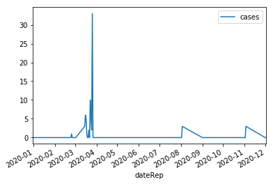
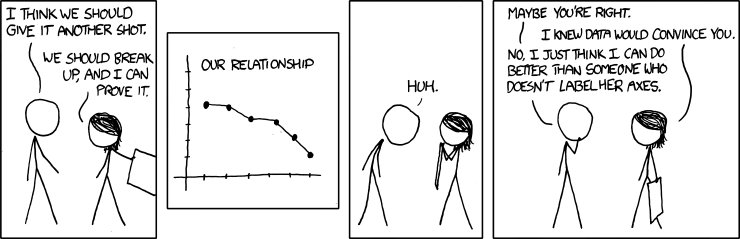

### Questions

### Objectives

### Outline

* If you want to install plotly just run 
    * `!pip install plotly` in your jupyter notebook **OR**
    * `pip install plotly` in your terminal
    
* Load in data
* Make plotly visualizations
* Show how plotly can be used in dash apps


```python
import pandas as pd
import numpy as np

import matplotlib.pyplot as plt
```


```python
df = pd.read_csv("data/covid19.csv", encoding='ISO-8859-1')
```


```python
df['dateRep'] = pd.to_datetime(df["dateRep"])
df.head()
```


<div>
<style scoped>
    .dataframe tbody tr th:only-of-type {
        vertical-align: middle;
    }

    .dataframe tbody tr th {
        vertical-align: top;
    }

    .dataframe thead th {
        text-align: right;
    }
</style>
<table border="1" class="dataframe">
  <thead>
    <tr style="text-align: right;">
      <th></th>
      <th>dateRep</th>
      <th>day</th>
      <th>month</th>
      <th>year</th>
      <th>cases</th>
      <th>deaths</th>
      <th>countriesAndTerritories</th>
      <th>geoId</th>
      <th>countryterritoryCode</th>
      <th>popData2018</th>
    </tr>
  </thead>
  <tbody>
    <tr>
      <td>0</td>
      <td>2020-03-27</td>
      <td>27</td>
      <td>3</td>
      <td>2020</td>
      <td>0</td>
      <td>0</td>
      <td>Afghanistan</td>
      <td>AF</td>
      <td>AFG</td>
      <td>37172386.0</td>
    </tr>
    <tr>
      <td>1</td>
      <td>2020-03-26</td>
      <td>26</td>
      <td>3</td>
      <td>2020</td>
      <td>33</td>
      <td>0</td>
      <td>Afghanistan</td>
      <td>AF</td>
      <td>AFG</td>
      <td>37172386.0</td>
    </tr>
    <tr>
      <td>2</td>
      <td>2020-03-25</td>
      <td>25</td>
      <td>3</td>
      <td>2020</td>
      <td>2</td>
      <td>0</td>
      <td>Afghanistan</td>
      <td>AF</td>
      <td>AFG</td>
      <td>37172386.0</td>
    </tr>
    <tr>
      <td>3</td>
      <td>2020-03-24</td>
      <td>24</td>
      <td>3</td>
      <td>2020</td>
      <td>6</td>
      <td>1</td>
      <td>Afghanistan</td>
      <td>AF</td>
      <td>AFG</td>
      <td>37172386.0</td>
    </tr>
    <tr>
      <td>4</td>
      <td>2020-03-23</td>
      <td>23</td>
      <td>3</td>
      <td>2020</td>
      <td>10</td>
      <td>0</td>
      <td>Afghanistan</td>
      <td>AF</td>
      <td>AFG</td>
      <td>37172386.0</td>
    </tr>
  </tbody>
</table>
</div>


```python
df.sort_values(by="dateRep", inplace=True)
df.reset_index(inplace=True, drop=True)
df.head()
```


<div>
<style scoped>
    .dataframe tbody tr th:only-of-type {
        vertical-align: middle;
    }

    .dataframe tbody tr th {
        vertical-align: top;
    }

    .dataframe thead th {
        text-align: right;
    }
</style>
<table border="1" class="dataframe">
  <thead>
    <tr style="text-align: right;">
      <th></th>
      <th>dateRep</th>
      <th>day</th>
      <th>month</th>
      <th>year</th>
      <th>cases</th>
      <th>deaths</th>
      <th>countriesAndTerritories</th>
      <th>geoId</th>
      <th>countryterritoryCode</th>
      <th>popData2018</th>
    </tr>
  </thead>
  <tbody>
    <tr>
      <td>0</td>
      <td>2019-12-31</td>
      <td>31</td>
      <td>12</td>
      <td>2019</td>
      <td>0</td>
      <td>0</td>
      <td>Singapore</td>
      <td>SG</td>
      <td>SGP</td>
      <td>5638676.0</td>
    </tr>
    <tr>
      <td>1</td>
      <td>2019-12-31</td>
      <td>31</td>
      <td>12</td>
      <td>2019</td>
      <td>0</td>
      <td>0</td>
      <td>Greece</td>
      <td>EL</td>
      <td>GRC</td>
      <td>10727668.0</td>
    </tr>
    <tr>
      <td>2</td>
      <td>2019-12-31</td>
      <td>31</td>
      <td>12</td>
      <td>2019</td>
      <td>0</td>
      <td>0</td>
      <td>Lithuania</td>
      <td>LT</td>
      <td>LTU</td>
      <td>2789533.0</td>
    </tr>
    <tr>
      <td>3</td>
      <td>2019-12-31</td>
      <td>31</td>
      <td>12</td>
      <td>2019</td>
      <td>0</td>
      <td>0</td>
      <td>Canada</td>
      <td>CA</td>
      <td>CAN</td>
      <td>37058856.0</td>
    </tr>
    <tr>
      <td>4</td>
      <td>2019-12-31</td>
      <td>31</td>
      <td>12</td>
      <td>2019</td>
      <td>0</td>
      <td>0</td>
      <td>Brazil</td>
      <td>BR</td>
      <td>BRA</td>
      <td>209469333.0</td>
    </tr>
  </tbody>
</table>
</div>


# Time Series Graphing in Pandas/Matplotlib


```python
# in pandas with matplotlib

df_Afg = df.loc[df["countriesAndTerritories"]=="Afghanistan", ["dateRep", "cases"]]
df_Afg.head()
```


<div>
<style scoped>
    .dataframe tbody tr th:only-of-type {
        vertical-align: middle;
    }

    .dataframe tbody tr th {
        vertical-align: top;
    }

    .dataframe thead th {
        text-align: right;
    }
</style>
<table border="1" class="dataframe">
  <thead>
    <tr style="text-align: right;">
      <th></th>
      <th>dateRep</th>
      <th>cases</th>
    </tr>
  </thead>
  <tbody>
    <tr>
      <td>20</td>
      <td>2019-12-31</td>
      <td>0</td>
    </tr>
    <tr>
      <td>131</td>
      <td>2020-01-01</td>
      <td>0</td>
    </tr>
    <tr>
      <td>190</td>
      <td>2020-01-02</td>
      <td>0</td>
    </tr>
    <tr>
      <td>261</td>
      <td>2020-01-03</td>
      <td>0</td>
    </tr>
    <tr>
      <td>271</td>
      <td>2020-01-13</td>
      <td>0</td>
    </tr>
  </tbody>
</table>
</div>


```python
df_Afg.set_index("dateRep").plot()
```


    <matplotlib.axes._subplots.AxesSubplot at 0x12fffc898>





# Time Series Plotting with Plotly


```python
import plotly.graph_objects as go
```


```python
fig = go.Figure()
df_Afg = df.loc[df["geoId"]=="AF"]
trace = go.Scatter(x=df_Afg["dateRep"], y=df_Afg["cases"], mode="lines+markers", name="AF")

fig.add_trace(trace)
```


<div>
        
        
            <div id="f22354ce-a7f2-44ce-ae8e-eadc1301c59b" class="plotly-graph-div" style="height:525px; width:100%;"></div>
            <script type="text/javascript">
                require(["plotly"], function(Plotly) {
                    window.PLOTLYENV=window.PLOTLYENV || {};
                    
                if (document.getElementById("f22354ce-a7f2-44ce-ae8e-eadc1301c59b")) {
                    Plotly.newPlot(
                        'f22354ce-a7f2-44ce-ae8e-eadc1301c59b',
                        [{"mode": "lines+markers", "name": "AF", "type": "scatter", "x": ["2019-12-31T00:00:00", "2020-01-01T00:00:00", "2020-01-02T00:00:00", "2020-01-03T00:00:00", "2020-01-13T00:00:00", "2020-01-14T00:00:00", "2020-01-15T00:00:00", "2020-01-16T00:00:00", "2020-01-17T00:00:00", "2020-01-18T00:00:00", "2020-01-19T00:00:00", "2020-01-20T00:00:00", "2020-01-21T00:00:00", "2020-01-22T00:00:00", "2020-01-23T00:00:00", "2020-01-24T00:00:00", "2020-01-25T00:00:00", "2020-01-26T00:00:00", "2020-01-27T00:00:00", "2020-01-28T00:00:00", "2020-01-29T00:00:00", "2020-01-30T00:00:00", "2020-01-31T00:00:00", "2020-02-01T00:00:00", "2020-02-02T00:00:00", "2020-02-03T00:00:00", "2020-02-13T00:00:00", "2020-02-14T00:00:00", "2020-02-15T00:00:00", "2020-02-16T00:00:00", "2020-02-17T00:00:00", "2020-02-18T00:00:00", "2020-02-19T00:00:00", "2020-02-20T00:00:00", "2020-02-21T00:00:00", "2020-02-22T00:00:00", "2020-02-23T00:00:00", "2020-02-24T00:00:00", "2020-02-25T00:00:00", "2020-02-26T00:00:00", "2020-02-27T00:00:00", "2020-02-28T00:00:00", "2020-02-29T00:00:00", "2020-03-01T00:00:00", "2020-03-02T00:00:00", "2020-03-15T00:00:00", "2020-03-16T00:00:00", "2020-03-17T00:00:00", "2020-03-18T00:00:00", "2020-03-19T00:00:00", "2020-03-20T00:00:00", "2020-03-21T00:00:00", "2020-03-22T00:00:00", "2020-03-23T00:00:00", "2020-03-24T00:00:00", "2020-03-25T00:00:00", "2020-03-26T00:00:00", "2020-03-27T00:00:00", "2020-04-01T00:00:00", "2020-04-02T00:00:00", "2020-05-01T00:00:00", "2020-05-02T00:00:00", "2020-06-01T00:00:00", "2020-06-02T00:00:00", "2020-07-01T00:00:00", "2020-07-02T00:00:00", "2020-08-01T00:00:00", "2020-08-02T00:00:00", "2020-08-03T00:00:00", "2020-09-01T00:00:00", "2020-09-02T00:00:00", "2020-10-01T00:00:00", "2020-10-02T00:00:00", "2020-11-01T00:00:00", "2020-11-02T00:00:00", "2020-11-03T00:00:00", "2020-12-01T00:00:00", "2020-12-02T00:00:00"], "y": [0, 0, 0, 0, 0, 0, 0, 0, 0, 0, 0, 0, 0, 0, 0, 0, 0, 0, 0, 0, 0, 0, 0, 0, 0, 0, 0, 0, 0, 0, 0, 0, 0, 0, 0, 0, 0, 0, 1, 0, 0, 0, 0, 0, 0, 3, 6, 5, 1, 0, 0, 2, 0, 10, 6, 2, 33, 0, 0, 0, 0, 0, 0, 0, 0, 0, 0, 0, 3, 0, 0, 0, 0, 0, 0, 3, 0, 0]}],
                        {"template": {"data": {"bar": [{"error_x": {"color": "#2a3f5f"}, "error_y": {"color": "#2a3f5f"}, "marker": {"line": {"color": "#E5ECF6", "width": 0.5}}, "type": "bar"}], "barpolar": [{"marker": {"line": {"color": "#E5ECF6", "width": 0.5}}, "type": "barpolar"}], "carpet": [{"aaxis": {"endlinecolor": "#2a3f5f", "gridcolor": "white", "linecolor": "white", "minorgridcolor": "white", "startlinecolor": "#2a3f5f"}, "baxis": {"endlinecolor": "#2a3f5f", "gridcolor": "white", "linecolor": "white", "minorgridcolor": "white", "startlinecolor": "#2a3f5f"}, "type": "carpet"}], "choropleth": [{"colorbar": {"outlinewidth": 0, "ticks": ""}, "type": "choropleth"}], "contour": [{"colorbar": {"outlinewidth": 0, "ticks": ""}, "colorscale": [[0.0, "#0d0887"], [0.1111111111111111, "#46039f"], [0.2222222222222222, "#7201a8"], [0.3333333333333333, "#9c179e"], [0.4444444444444444, "#bd3786"], [0.5555555555555556, "#d8576b"], [0.6666666666666666, "#ed7953"], [0.7777777777777778, "#fb9f3a"], [0.8888888888888888, "#fdca26"], [1.0, "#f0f921"]], "type": "contour"}], "contourcarpet": [{"colorbar": {"outlinewidth": 0, "ticks": ""}, "type": "contourcarpet"}], "heatmap": [{"colorbar": {"outlinewidth": 0, "ticks": ""}, "colorscale": [[0.0, "#0d0887"], [0.1111111111111111, "#46039f"], [0.2222222222222222, "#7201a8"], [0.3333333333333333, "#9c179e"], [0.4444444444444444, "#bd3786"], [0.5555555555555556, "#d8576b"], [0.6666666666666666, "#ed7953"], [0.7777777777777778, "#fb9f3a"], [0.8888888888888888, "#fdca26"], [1.0, "#f0f921"]], "type": "heatmap"}], "heatmapgl": [{"colorbar": {"outlinewidth": 0, "ticks": ""}, "colorscale": [[0.0, "#0d0887"], [0.1111111111111111, "#46039f"], [0.2222222222222222, "#7201a8"], [0.3333333333333333, "#9c179e"], [0.4444444444444444, "#bd3786"], [0.5555555555555556, "#d8576b"], [0.6666666666666666, "#ed7953"], [0.7777777777777778, "#fb9f3a"], [0.8888888888888888, "#fdca26"], [1.0, "#f0f921"]], "type": "heatmapgl"}], "histogram": [{"marker": {"colorbar": {"outlinewidth": 0, "ticks": ""}}, "type": "histogram"}], "histogram2d": [{"colorbar": {"outlinewidth": 0, "ticks": ""}, "colorscale": [[0.0, "#0d0887"], [0.1111111111111111, "#46039f"], [0.2222222222222222, "#7201a8"], [0.3333333333333333, "#9c179e"], [0.4444444444444444, "#bd3786"], [0.5555555555555556, "#d8576b"], [0.6666666666666666, "#ed7953"], [0.7777777777777778, "#fb9f3a"], [0.8888888888888888, "#fdca26"], [1.0, "#f0f921"]], "type": "histogram2d"}], "histogram2dcontour": [{"colorbar": {"outlinewidth": 0, "ticks": ""}, "colorscale": [[0.0, "#0d0887"], [0.1111111111111111, "#46039f"], [0.2222222222222222, "#7201a8"], [0.3333333333333333, "#9c179e"], [0.4444444444444444, "#bd3786"], [0.5555555555555556, "#d8576b"], [0.6666666666666666, "#ed7953"], [0.7777777777777778, "#fb9f3a"], [0.8888888888888888, "#fdca26"], [1.0, "#f0f921"]], "type": "histogram2dcontour"}], "mesh3d": [{"colorbar": {"outlinewidth": 0, "ticks": ""}, "type": "mesh3d"}], "parcoords": [{"line": {"colorbar": {"outlinewidth": 0, "ticks": ""}}, "type": "parcoords"}], "scatter": [{"marker": {"colorbar": {"outlinewidth": 0, "ticks": ""}}, "type": "scatter"}], "scatter3d": [{"line": {"colorbar": {"outlinewidth": 0, "ticks": ""}}, "marker": {"colorbar": {"outlinewidth": 0, "ticks": ""}}, "type": "scatter3d"}], "scattercarpet": [{"marker": {"colorbar": {"outlinewidth": 0, "ticks": ""}}, "type": "scattercarpet"}], "scattergeo": [{"marker": {"colorbar": {"outlinewidth": 0, "ticks": ""}}, "type": "scattergeo"}], "scattergl": [{"marker": {"colorbar": {"outlinewidth": 0, "ticks": ""}}, "type": "scattergl"}], "scattermapbox": [{"marker": {"colorbar": {"outlinewidth": 0, "ticks": ""}}, "type": "scattermapbox"}], "scatterpolar": [{"marker": {"colorbar": {"outlinewidth": 0, "ticks": ""}}, "type": "scatterpolar"}], "scatterpolargl": [{"marker": {"colorbar": {"outlinewidth": 0, "ticks": ""}}, "type": "scatterpolargl"}], "scatterternary": [{"marker": {"colorbar": {"outlinewidth": 0, "ticks": ""}}, "type": "scatterternary"}], "surface": [{"colorbar": {"outlinewidth": 0, "ticks": ""}, "colorscale": [[0.0, "#0d0887"], [0.1111111111111111, "#46039f"], [0.2222222222222222, "#7201a8"], [0.3333333333333333, "#9c179e"], [0.4444444444444444, "#bd3786"], [0.5555555555555556, "#d8576b"], [0.6666666666666666, "#ed7953"], [0.7777777777777778, "#fb9f3a"], [0.8888888888888888, "#fdca26"], [1.0, "#f0f921"]], "type": "surface"}], "table": [{"cells": {"fill": {"color": "#EBF0F8"}, "line": {"color": "white"}}, "header": {"fill": {"color": "#C8D4E3"}, "line": {"color": "white"}}, "type": "table"}]}, "layout": {"annotationdefaults": {"arrowcolor": "#2a3f5f", "arrowhead": 0, "arrowwidth": 1}, "colorscale": {"diverging": [[0, "#8e0152"], [0.1, "#c51b7d"], [0.2, "#de77ae"], [0.3, "#f1b6da"], [0.4, "#fde0ef"], [0.5, "#f7f7f7"], [0.6, "#e6f5d0"], [0.7, "#b8e186"], [0.8, "#7fbc41"], [0.9, "#4d9221"], [1, "#276419"]], "sequential": [[0.0, "#0d0887"], [0.1111111111111111, "#46039f"], [0.2222222222222222, "#7201a8"], [0.3333333333333333, "#9c179e"], [0.4444444444444444, "#bd3786"], [0.5555555555555556, "#d8576b"], [0.6666666666666666, "#ed7953"], [0.7777777777777778, "#fb9f3a"], [0.8888888888888888, "#fdca26"], [1.0, "#f0f921"]], "sequentialminus": [[0.0, "#0d0887"], [0.1111111111111111, "#46039f"], [0.2222222222222222, "#7201a8"], [0.3333333333333333, "#9c179e"], [0.4444444444444444, "#bd3786"], [0.5555555555555556, "#d8576b"], [0.6666666666666666, "#ed7953"], [0.7777777777777778, "#fb9f3a"], [0.8888888888888888, "#fdca26"], [1.0, "#f0f921"]]}, "colorway": ["#636efa", "#EF553B", "#00cc96", "#ab63fa", "#FFA15A", "#19d3f3", "#FF6692", "#B6E880", "#FF97FF", "#FECB52"], "font": {"color": "#2a3f5f"}, "geo": {"bgcolor": "white", "lakecolor": "white", "landcolor": "#E5ECF6", "showlakes": true, "showland": true, "subunitcolor": "white"}, "hoverlabel": {"align": "left"}, "hovermode": "closest", "mapbox": {"style": "light"}, "paper_bgcolor": "white", "plot_bgcolor": "#E5ECF6", "polar": {"angularaxis": {"gridcolor": "white", "linecolor": "white", "ticks": ""}, "bgcolor": "#E5ECF6", "radialaxis": {"gridcolor": "white", "linecolor": "white", "ticks": ""}}, "scene": {"xaxis": {"backgroundcolor": "#E5ECF6", "gridcolor": "white", "gridwidth": 2, "linecolor": "white", "showbackground": true, "ticks": "", "zerolinecolor": "white"}, "yaxis": {"backgroundcolor": "#E5ECF6", "gridcolor": "white", "gridwidth": 2, "linecolor": "white", "showbackground": true, "ticks": "", "zerolinecolor": "white"}, "zaxis": {"backgroundcolor": "#E5ECF6", "gridcolor": "white", "gridwidth": 2, "linecolor": "white", "showbackground": true, "ticks": "", "zerolinecolor": "white"}}, "shapedefaults": {"line": {"color": "#2a3f5f"}}, "ternary": {"aaxis": {"gridcolor": "white", "linecolor": "white", "ticks": ""}, "baxis": {"gridcolor": "white", "linecolor": "white", "ticks": ""}, "bgcolor": "#E5ECF6", "caxis": {"gridcolor": "white", "linecolor": "white", "ticks": ""}}, "title": {"x": 0.05}, "xaxis": {"automargin": true, "gridcolor": "white", "linecolor": "white", "ticks": "", "zerolinecolor": "white", "zerolinewidth": 2}, "yaxis": {"automargin": true, "gridcolor": "white", "linecolor": "white", "ticks": "", "zerolinecolor": "white", "zerolinewidth": 2}}}},
                        {"responsive": true}
                    ).then(function(){
                            
var gd = document.getElementById('f22354ce-a7f2-44ce-ae8e-eadc1301c59b');
var x = new MutationObserver(function (mutations, observer) {{
        var display = window.getComputedStyle(gd).display;
        if (!display || display === 'none') {{
            console.log([gd, 'removed!']);
            Plotly.purge(gd);
            observer.disconnect();
        }}
}});

// Listen for the removal of the full notebook cells
var notebookContainer = gd.closest('#notebook-container');
if (notebookContainer) {{
    x.observe(notebookContainer, {childList: true});
}}

// Listen for the clearing of the current output cell
var outputEl = gd.closest('.output');
if (outputEl) {{
    x.observe(outputEl, {childList: true});
}}

                        })
                };
                });
            </script>
        </div>


# plotting multiple lines


```python
usa_border_buddies = ["United_States_of_America", "Mexico", "Canada"]

fig = go.Figure()
df_USA = df.loc[df["countriesAndTerritories"]=="United_States_of_America"]
trace1 = go.Scatter(x=df_USA["dateRep"], y=df_USA["cases"], mode="lines+markers", name="US")
fig.add_trace(trace1)

df_MEXICO = df.loc[df["countriesAndTerritories"]=="Mexico"]
trace2 = go.Scatter(x=df_MEXICO["dateRep"], y=df_MEXICO["cases"], mode="lines+markers", name="Mexico")
fig.add_trace(trace2)


df_CANADA = df.loc[df["countriesAndTerritories"]=="Canada"]
trace3 = go.Scatter(x=df_CANADA["dateRep"], y=df_CANADA["cases"], mode="lines+markers", name="Canada")
fig.add_trace(trace3)


fig.show()
```


<div>
        
        
            <div id="62dd424c-6178-45d1-9b7e-74614ea69ab7" class="plotly-graph-div" style="height:525px; width:100%;"></div>
            <script type="text/javascript">
                require(["plotly"], function(Plotly) {
                    window.PLOTLYENV=window.PLOTLYENV || {};
                    
                if (document.getElementById("62dd424c-6178-45d1-9b7e-74614ea69ab7")) {
                    Plotly.newPlot(
                        '62dd424c-6178-45d1-9b7e-74614ea69ab7',
                        [{"mode": "lines+markers", "name": "US", "type": "scatter", "x": ["2019-12-31T00:00:00", "2020-01-01T00:00:00", "2020-01-02T00:00:00", "2020-01-03T00:00:00", "2020-01-13T00:00:00", "2020-01-14T00:00:00", "2020-01-15T00:00:00", "2020-01-16T00:00:00", "2020-01-17T00:00:00", "2020-01-18T00:00:00", "2020-01-19T00:00:00", "2020-01-20T00:00:00", "2020-01-21T00:00:00", "2020-01-22T00:00:00", "2020-01-23T00:00:00", "2020-01-24T00:00:00", "2020-01-25T00:00:00", "2020-01-26T00:00:00", "2020-01-27T00:00:00", "2020-01-28T00:00:00", "2020-01-29T00:00:00", "2020-01-30T00:00:00", "2020-01-31T00:00:00", "2020-02-01T00:00:00", "2020-02-02T00:00:00", "2020-02-03T00:00:00", "2020-02-13T00:00:00", "2020-02-14T00:00:00", "2020-02-15T00:00:00", "2020-02-16T00:00:00", "2020-02-17T00:00:00", "2020-02-18T00:00:00", "2020-02-19T00:00:00", "2020-02-20T00:00:00", "2020-02-21T00:00:00", "2020-02-22T00:00:00", "2020-02-23T00:00:00", "2020-02-24T00:00:00", "2020-02-25T00:00:00", "2020-02-26T00:00:00", "2020-02-27T00:00:00", "2020-02-28T00:00:00", "2020-02-29T00:00:00", "2020-03-01T00:00:00", "2020-03-02T00:00:00", "2020-03-03T00:00:00", "2020-03-13T00:00:00", "2020-03-14T00:00:00", "2020-03-15T00:00:00", "2020-03-16T00:00:00", "2020-03-17T00:00:00", "2020-03-18T00:00:00", "2020-03-19T00:00:00", "2020-03-20T00:00:00", "2020-03-21T00:00:00", "2020-03-22T00:00:00", "2020-03-23T00:00:00", "2020-03-24T00:00:00", "2020-03-25T00:00:00", "2020-03-26T00:00:00", "2020-03-27T00:00:00", "2020-04-01T00:00:00", "2020-04-02T00:00:00", "2020-04-03T00:00:00", "2020-05-01T00:00:00", "2020-05-02T00:00:00", "2020-05-03T00:00:00", "2020-06-01T00:00:00", "2020-06-02T00:00:00", "2020-06-03T00:00:00", "2020-07-01T00:00:00", "2020-07-02T00:00:00", "2020-07-03T00:00:00", "2020-08-01T00:00:00", "2020-08-02T00:00:00", "2020-08-03T00:00:00", "2020-09-01T00:00:00", "2020-09-02T00:00:00", "2020-09-03T00:00:00", "2020-10-01T00:00:00", "2020-10-02T00:00:00", "2020-10-03T00:00:00", "2020-11-01T00:00:00", "2020-11-02T00:00:00", "2020-11-03T00:00:00", "2020-12-01T00:00:00", "2020-12-02T00:00:00", "2020-12-03T00:00:00"], "y": [0, 0, 1, 3, 0, 0, 0, 0, 0, 0, 0, 0, 1, 0, 0, 0, 1, 0, 3, 0, 0, 0, 1, 0, 1, 20, 1, 1, 0, 0, 0, 0, 0, 0, 1, 19, 0, 0, 18, 0, 6, 1, 6, 0, 3, 14, 351, 511, 777, 823, 887, 1766, 2988, 4835, 5374, 7123, 8459, 11236, 8789, 13963, 16797, 0, 0, 22, 0, 0, 34, 0, 1, 74, 0, 0, 105, 0, 0, 95, 0, 0, 121, 0, 0, 200, 0, 1, 271, 0, 0, 287]}, {"mode": "lines+markers", "name": "Mexico", "type": "scatter", "x": ["2019-12-31T00:00:00", "2020-01-01T00:00:00", "2020-01-02T00:00:00", "2020-01-03T00:00:00", "2020-01-13T00:00:00", "2020-01-14T00:00:00", "2020-01-15T00:00:00", "2020-01-16T00:00:00", "2020-01-17T00:00:00", "2020-01-18T00:00:00", "2020-01-19T00:00:00", "2020-01-20T00:00:00", "2020-01-21T00:00:00", "2020-01-22T00:00:00", "2020-01-23T00:00:00", "2020-01-24T00:00:00", "2020-01-25T00:00:00", "2020-01-26T00:00:00", "2020-01-27T00:00:00", "2020-01-28T00:00:00", "2020-01-29T00:00:00", "2020-01-30T00:00:00", "2020-01-31T00:00:00", "2020-02-01T00:00:00", "2020-02-02T00:00:00", "2020-02-03T00:00:00", "2020-02-13T00:00:00", "2020-02-14T00:00:00", "2020-02-15T00:00:00", "2020-02-16T00:00:00", "2020-02-17T00:00:00", "2020-02-18T00:00:00", "2020-02-19T00:00:00", "2020-02-20T00:00:00", "2020-02-21T00:00:00", "2020-02-22T00:00:00", "2020-02-23T00:00:00", "2020-02-24T00:00:00", "2020-02-25T00:00:00", "2020-02-26T00:00:00", "2020-02-27T00:00:00", "2020-02-28T00:00:00", "2020-02-29T00:00:00", "2020-03-01T00:00:00", "2020-03-02T00:00:00", "2020-03-13T00:00:00", "2020-03-14T00:00:00", "2020-03-15T00:00:00", "2020-03-16T00:00:00", "2020-03-17T00:00:00", "2020-03-18T00:00:00", "2020-03-19T00:00:00", "2020-03-20T00:00:00", "2020-03-21T00:00:00", "2020-03-22T00:00:00", "2020-03-23T00:00:00", "2020-03-24T00:00:00", "2020-03-25T00:00:00", "2020-03-26T00:00:00", "2020-03-27T00:00:00", "2020-04-01T00:00:00", "2020-04-02T00:00:00", "2020-05-01T00:00:00", "2020-05-02T00:00:00", "2020-06-01T00:00:00", "2020-06-02T00:00:00", "2020-07-01T00:00:00", "2020-07-02T00:00:00", "2020-08-01T00:00:00", "2020-08-02T00:00:00", "2020-09-01T00:00:00", "2020-09-02T00:00:00", "2020-09-03T00:00:00", "2020-10-01T00:00:00", "2020-10-02T00:00:00", "2020-11-01T00:00:00", "2020-11-02T00:00:00", "2020-12-01T00:00:00", "2020-12-02T00:00:00", "2020-12-03T00:00:00"], "y": [0, 0, 0, 2, 0, 0, 0, 0, 0, 0, 0, 0, 0, 0, 0, 0, 0, 0, 0, 0, 0, 0, 0, 0, 0, 1, 0, 0, 0, 0, 0, 0, 0, 0, 0, 0, 0, 0, 0, 0, 0, 0, 2, 0, 0, 5, 10, 15, 12, 29, 11, 25, 46, 39, 48, 65, 51, 38, 70, 110, 0, 0, 0, 0, 0, 0, 0, 0, 0, 0, 0, 0, 2, 0, 0, 0, 0, 0, 0, 4]}, {"mode": "lines+markers", "name": "Canada", "type": "scatter", "x": ["2019-12-31T00:00:00", "2020-01-01T00:00:00", "2020-01-02T00:00:00", "2020-01-03T00:00:00", "2020-01-13T00:00:00", "2020-01-14T00:00:00", "2020-01-15T00:00:00", "2020-01-16T00:00:00", "2020-01-17T00:00:00", "2020-01-18T00:00:00", "2020-01-19T00:00:00", "2020-01-20T00:00:00", "2020-01-21T00:00:00", "2020-01-22T00:00:00", "2020-01-23T00:00:00", "2020-01-24T00:00:00", "2020-01-25T00:00:00", "2020-01-26T00:00:00", "2020-01-27T00:00:00", "2020-01-28T00:00:00", "2020-01-29T00:00:00", "2020-01-30T00:00:00", "2020-01-31T00:00:00", "2020-02-01T00:00:00", "2020-02-02T00:00:00", "2020-02-03T00:00:00", "2020-02-13T00:00:00", "2020-02-14T00:00:00", "2020-02-15T00:00:00", "2020-02-16T00:00:00", "2020-02-17T00:00:00", "2020-02-18T00:00:00", "2020-02-19T00:00:00", "2020-02-20T00:00:00", "2020-02-21T00:00:00", "2020-02-22T00:00:00", "2020-02-23T00:00:00", "2020-02-24T00:00:00", "2020-02-25T00:00:00", "2020-02-26T00:00:00", "2020-02-27T00:00:00", "2020-02-28T00:00:00", "2020-02-29T00:00:00", "2020-03-01T00:00:00", "2020-03-02T00:00:00", "2020-03-03T00:00:00", "2020-03-13T00:00:00", "2020-03-14T00:00:00", "2020-03-15T00:00:00", "2020-03-16T00:00:00", "2020-03-17T00:00:00", "2020-03-18T00:00:00", "2020-03-19T00:00:00", "2020-03-20T00:00:00", "2020-03-21T00:00:00", "2020-03-22T00:00:00", "2020-03-23T00:00:00", "2020-03-24T00:00:00", "2020-03-25T00:00:00", "2020-03-26T00:00:00", "2020-03-27T00:00:00", "2020-04-01T00:00:00", "2020-04-02T00:00:00", "2020-04-03T00:00:00", "2020-05-01T00:00:00", "2020-05-02T00:00:00", "2020-05-03T00:00:00", "2020-06-01T00:00:00", "2020-06-02T00:00:00", "2020-06-03T00:00:00", "2020-07-01T00:00:00", "2020-07-02T00:00:00", "2020-07-03T00:00:00", "2020-08-01T00:00:00", "2020-08-02T00:00:00", "2020-08-03T00:00:00", "2020-09-01T00:00:00", "2020-09-02T00:00:00", "2020-09-03T00:00:00", "2020-10-01T00:00:00", "2020-10-02T00:00:00", "2020-10-03T00:00:00", "2020-11-01T00:00:00", "2020-11-02T00:00:00", "2020-11-03T00:00:00", "2020-12-01T00:00:00", "2020-12-02T00:00:00", "2020-12-03T00:00:00"], "y": [0, 0, 1, 4, 0, 0, 0, 0, 0, 0, 0, 0, 0, 0, 0, 0, 0, 1, 0, 1, 1, 0, 0, 0, 0, 4, 0, 0, 1, 0, 0, 0, 0, 0, 1, 0, 0, 0, 2, 0, 1, 2, 2, 0, 0, 3, 35, 38, 68, 60, 120, 145, 121, 156, 125, 260, 199, 216, 313, 1426, 633, 0, 0, 3, 0, 1, 3, 0, 0, 12, 0, 2, 6, 0, 0, 6, 0, 0, 5, 0, 0, 15, 0, 0, 16, 0, 0, 10]}],
                        {"template": {"data": {"bar": [{"error_x": {"color": "#2a3f5f"}, "error_y": {"color": "#2a3f5f"}, "marker": {"line": {"color": "#E5ECF6", "width": 0.5}}, "type": "bar"}], "barpolar": [{"marker": {"line": {"color": "#E5ECF6", "width": 0.5}}, "type": "barpolar"}], "carpet": [{"aaxis": {"endlinecolor": "#2a3f5f", "gridcolor": "white", "linecolor": "white", "minorgridcolor": "white", "startlinecolor": "#2a3f5f"}, "baxis": {"endlinecolor": "#2a3f5f", "gridcolor": "white", "linecolor": "white", "minorgridcolor": "white", "startlinecolor": "#2a3f5f"}, "type": "carpet"}], "choropleth": [{"colorbar": {"outlinewidth": 0, "ticks": ""}, "type": "choropleth"}], "contour": [{"colorbar": {"outlinewidth": 0, "ticks": ""}, "colorscale": [[0.0, "#0d0887"], [0.1111111111111111, "#46039f"], [0.2222222222222222, "#7201a8"], [0.3333333333333333, "#9c179e"], [0.4444444444444444, "#bd3786"], [0.5555555555555556, "#d8576b"], [0.6666666666666666, "#ed7953"], [0.7777777777777778, "#fb9f3a"], [0.8888888888888888, "#fdca26"], [1.0, "#f0f921"]], "type": "contour"}], "contourcarpet": [{"colorbar": {"outlinewidth": 0, "ticks": ""}, "type": "contourcarpet"}], "heatmap": [{"colorbar": {"outlinewidth": 0, "ticks": ""}, "colorscale": [[0.0, "#0d0887"], [0.1111111111111111, "#46039f"], [0.2222222222222222, "#7201a8"], [0.3333333333333333, "#9c179e"], [0.4444444444444444, "#bd3786"], [0.5555555555555556, "#d8576b"], [0.6666666666666666, "#ed7953"], [0.7777777777777778, "#fb9f3a"], [0.8888888888888888, "#fdca26"], [1.0, "#f0f921"]], "type": "heatmap"}], "heatmapgl": [{"colorbar": {"outlinewidth": 0, "ticks": ""}, "colorscale": [[0.0, "#0d0887"], [0.1111111111111111, "#46039f"], [0.2222222222222222, "#7201a8"], [0.3333333333333333, "#9c179e"], [0.4444444444444444, "#bd3786"], [0.5555555555555556, "#d8576b"], [0.6666666666666666, "#ed7953"], [0.7777777777777778, "#fb9f3a"], [0.8888888888888888, "#fdca26"], [1.0, "#f0f921"]], "type": "heatmapgl"}], "histogram": [{"marker": {"colorbar": {"outlinewidth": 0, "ticks": ""}}, "type": "histogram"}], "histogram2d": [{"colorbar": {"outlinewidth": 0, "ticks": ""}, "colorscale": [[0.0, "#0d0887"], [0.1111111111111111, "#46039f"], [0.2222222222222222, "#7201a8"], [0.3333333333333333, "#9c179e"], [0.4444444444444444, "#bd3786"], [0.5555555555555556, "#d8576b"], [0.6666666666666666, "#ed7953"], [0.7777777777777778, "#fb9f3a"], [0.8888888888888888, "#fdca26"], [1.0, "#f0f921"]], "type": "histogram2d"}], "histogram2dcontour": [{"colorbar": {"outlinewidth": 0, "ticks": ""}, "colorscale": [[0.0, "#0d0887"], [0.1111111111111111, "#46039f"], [0.2222222222222222, "#7201a8"], [0.3333333333333333, "#9c179e"], [0.4444444444444444, "#bd3786"], [0.5555555555555556, "#d8576b"], [0.6666666666666666, "#ed7953"], [0.7777777777777778, "#fb9f3a"], [0.8888888888888888, "#fdca26"], [1.0, "#f0f921"]], "type": "histogram2dcontour"}], "mesh3d": [{"colorbar": {"outlinewidth": 0, "ticks": ""}, "type": "mesh3d"}], "parcoords": [{"line": {"colorbar": {"outlinewidth": 0, "ticks": ""}}, "type": "parcoords"}], "scatter": [{"marker": {"colorbar": {"outlinewidth": 0, "ticks": ""}}, "type": "scatter"}], "scatter3d": [{"line": {"colorbar": {"outlinewidth": 0, "ticks": ""}}, "marker": {"colorbar": {"outlinewidth": 0, "ticks": ""}}, "type": "scatter3d"}], "scattercarpet": [{"marker": {"colorbar": {"outlinewidth": 0, "ticks": ""}}, "type": "scattercarpet"}], "scattergeo": [{"marker": {"colorbar": {"outlinewidth": 0, "ticks": ""}}, "type": "scattergeo"}], "scattergl": [{"marker": {"colorbar": {"outlinewidth": 0, "ticks": ""}}, "type": "scattergl"}], "scattermapbox": [{"marker": {"colorbar": {"outlinewidth": 0, "ticks": ""}}, "type": "scattermapbox"}], "scatterpolar": [{"marker": {"colorbar": {"outlinewidth": 0, "ticks": ""}}, "type": "scatterpolar"}], "scatterpolargl": [{"marker": {"colorbar": {"outlinewidth": 0, "ticks": ""}}, "type": "scatterpolargl"}], "scatterternary": [{"marker": {"colorbar": {"outlinewidth": 0, "ticks": ""}}, "type": "scatterternary"}], "surface": [{"colorbar": {"outlinewidth": 0, "ticks": ""}, "colorscale": [[0.0, "#0d0887"], [0.1111111111111111, "#46039f"], [0.2222222222222222, "#7201a8"], [0.3333333333333333, "#9c179e"], [0.4444444444444444, "#bd3786"], [0.5555555555555556, "#d8576b"], [0.6666666666666666, "#ed7953"], [0.7777777777777778, "#fb9f3a"], [0.8888888888888888, "#fdca26"], [1.0, "#f0f921"]], "type": "surface"}], "table": [{"cells": {"fill": {"color": "#EBF0F8"}, "line": {"color": "white"}}, "header": {"fill": {"color": "#C8D4E3"}, "line": {"color": "white"}}, "type": "table"}]}, "layout": {"annotationdefaults": {"arrowcolor": "#2a3f5f", "arrowhead": 0, "arrowwidth": 1}, "colorscale": {"diverging": [[0, "#8e0152"], [0.1, "#c51b7d"], [0.2, "#de77ae"], [0.3, "#f1b6da"], [0.4, "#fde0ef"], [0.5, "#f7f7f7"], [0.6, "#e6f5d0"], [0.7, "#b8e186"], [0.8, "#7fbc41"], [0.9, "#4d9221"], [1, "#276419"]], "sequential": [[0.0, "#0d0887"], [0.1111111111111111, "#46039f"], [0.2222222222222222, "#7201a8"], [0.3333333333333333, "#9c179e"], [0.4444444444444444, "#bd3786"], [0.5555555555555556, "#d8576b"], [0.6666666666666666, "#ed7953"], [0.7777777777777778, "#fb9f3a"], [0.8888888888888888, "#fdca26"], [1.0, "#f0f921"]], "sequentialminus": [[0.0, "#0d0887"], [0.1111111111111111, "#46039f"], [0.2222222222222222, "#7201a8"], [0.3333333333333333, "#9c179e"], [0.4444444444444444, "#bd3786"], [0.5555555555555556, "#d8576b"], [0.6666666666666666, "#ed7953"], [0.7777777777777778, "#fb9f3a"], [0.8888888888888888, "#fdca26"], [1.0, "#f0f921"]]}, "colorway": ["#636efa", "#EF553B", "#00cc96", "#ab63fa", "#FFA15A", "#19d3f3", "#FF6692", "#B6E880", "#FF97FF", "#FECB52"], "font": {"color": "#2a3f5f"}, "geo": {"bgcolor": "white", "lakecolor": "white", "landcolor": "#E5ECF6", "showlakes": true, "showland": true, "subunitcolor": "white"}, "hoverlabel": {"align": "left"}, "hovermode": "closest", "mapbox": {"style": "light"}, "paper_bgcolor": "white", "plot_bgcolor": "#E5ECF6", "polar": {"angularaxis": {"gridcolor": "white", "linecolor": "white", "ticks": ""}, "bgcolor": "#E5ECF6", "radialaxis": {"gridcolor": "white", "linecolor": "white", "ticks": ""}}, "scene": {"xaxis": {"backgroundcolor": "#E5ECF6", "gridcolor": "white", "gridwidth": 2, "linecolor": "white", "showbackground": true, "ticks": "", "zerolinecolor": "white"}, "yaxis": {"backgroundcolor": "#E5ECF6", "gridcolor": "white", "gridwidth": 2, "linecolor": "white", "showbackground": true, "ticks": "", "zerolinecolor": "white"}, "zaxis": {"backgroundcolor": "#E5ECF6", "gridcolor": "white", "gridwidth": 2, "linecolor": "white", "showbackground": true, "ticks": "", "zerolinecolor": "white"}}, "shapedefaults": {"line": {"color": "#2a3f5f"}}, "ternary": {"aaxis": {"gridcolor": "white", "linecolor": "white", "ticks": ""}, "baxis": {"gridcolor": "white", "linecolor": "white", "ticks": ""}, "bgcolor": "#E5ECF6", "caxis": {"gridcolor": "white", "linecolor": "white", "ticks": ""}}, "title": {"x": 0.05}, "xaxis": {"automargin": true, "gridcolor": "white", "linecolor": "white", "ticks": "", "zerolinecolor": "white", "zerolinewidth": 2}, "yaxis": {"automargin": true, "gridcolor": "white", "linecolor": "white", "ticks": "", "zerolinecolor": "white", "zerolinewidth": 2}}}},
                        {"responsive": true}
                    ).then(function(){
                            
var gd = document.getElementById('62dd424c-6178-45d1-9b7e-74614ea69ab7');
var x = new MutationObserver(function (mutations, observer) {{
        var display = window.getComputedStyle(gd).display;
        if (!display || display === 'none') {{
            console.log([gd, 'removed!']);
            Plotly.purge(gd);
            observer.disconnect();
        }}
}});

// Listen for the removal of the full notebook cells
var notebookContainer = gd.closest('#notebook-container');
if (notebookContainer) {{
    x.observe(notebookContainer, {childList: true});
}}

// Listen for the clearing of the current output cell
var outputEl = gd.closest('.output');
if (outputEl) {{
    x.observe(outputEl, {childList: true});
}}

                        })
                };
                });
            </script>
        </div>


# Making the code DRY


```python
usa_border_buddies = ["United_States_of_America", "Mexico", "Canada"]

fig = go.Figure()

for country in usa_border_buddies:
    df_country = df.loc[df["countriesAndTerritories"]==country]
    geoId = df_country["geoId"].values[0]
    trace = go.Scatter(x=df_country["dateRep"], y=df_country["cases"], mode="lines+markers", name=geoId)
    fig.add_trace(trace)

fig.show()
```


<div>
        
        
            <div id="40711d19-a68a-47fe-87fb-a0a0b4d0f079" class="plotly-graph-div" style="height:525px; width:100%;"></div>
            <script type="text/javascript">
                require(["plotly"], function(Plotly) {
                    window.PLOTLYENV=window.PLOTLYENV || {};
                    
                if (document.getElementById("40711d19-a68a-47fe-87fb-a0a0b4d0f079")) {
                    Plotly.newPlot(
                        '40711d19-a68a-47fe-87fb-a0a0b4d0f079',
                        [{"mode": "lines+markers", "name": "US", "type": "scatter", "x": ["2019-12-31T00:00:00", "2020-01-01T00:00:00", "2020-01-02T00:00:00", "2020-01-03T00:00:00", "2020-01-13T00:00:00", "2020-01-14T00:00:00", "2020-01-15T00:00:00", "2020-01-16T00:00:00", "2020-01-17T00:00:00", "2020-01-18T00:00:00", "2020-01-19T00:00:00", "2020-01-20T00:00:00", "2020-01-21T00:00:00", "2020-01-22T00:00:00", "2020-01-23T00:00:00", "2020-01-24T00:00:00", "2020-01-25T00:00:00", "2020-01-26T00:00:00", "2020-01-27T00:00:00", "2020-01-28T00:00:00", "2020-01-29T00:00:00", "2020-01-30T00:00:00", "2020-01-31T00:00:00", "2020-02-01T00:00:00", "2020-02-02T00:00:00", "2020-02-03T00:00:00", "2020-02-13T00:00:00", "2020-02-14T00:00:00", "2020-02-15T00:00:00", "2020-02-16T00:00:00", "2020-02-17T00:00:00", "2020-02-18T00:00:00", "2020-02-19T00:00:00", "2020-02-20T00:00:00", "2020-02-21T00:00:00", "2020-02-22T00:00:00", "2020-02-23T00:00:00", "2020-02-24T00:00:00", "2020-02-25T00:00:00", "2020-02-26T00:00:00", "2020-02-27T00:00:00", "2020-02-28T00:00:00", "2020-02-29T00:00:00", "2020-03-01T00:00:00", "2020-03-02T00:00:00", "2020-03-03T00:00:00", "2020-03-13T00:00:00", "2020-03-14T00:00:00", "2020-03-15T00:00:00", "2020-03-16T00:00:00", "2020-03-17T00:00:00", "2020-03-18T00:00:00", "2020-03-19T00:00:00", "2020-03-20T00:00:00", "2020-03-21T00:00:00", "2020-03-22T00:00:00", "2020-03-23T00:00:00", "2020-03-24T00:00:00", "2020-03-25T00:00:00", "2020-03-26T00:00:00", "2020-03-27T00:00:00", "2020-04-01T00:00:00", "2020-04-02T00:00:00", "2020-04-03T00:00:00", "2020-05-01T00:00:00", "2020-05-02T00:00:00", "2020-05-03T00:00:00", "2020-06-01T00:00:00", "2020-06-02T00:00:00", "2020-06-03T00:00:00", "2020-07-01T00:00:00", "2020-07-02T00:00:00", "2020-07-03T00:00:00", "2020-08-01T00:00:00", "2020-08-02T00:00:00", "2020-08-03T00:00:00", "2020-09-01T00:00:00", "2020-09-02T00:00:00", "2020-09-03T00:00:00", "2020-10-01T00:00:00", "2020-10-02T00:00:00", "2020-10-03T00:00:00", "2020-11-01T00:00:00", "2020-11-02T00:00:00", "2020-11-03T00:00:00", "2020-12-01T00:00:00", "2020-12-02T00:00:00", "2020-12-03T00:00:00"], "y": [0, 0, 1, 3, 0, 0, 0, 0, 0, 0, 0, 0, 1, 0, 0, 0, 1, 0, 3, 0, 0, 0, 1, 0, 1, 20, 1, 1, 0, 0, 0, 0, 0, 0, 1, 19, 0, 0, 18, 0, 6, 1, 6, 0, 3, 14, 351, 511, 777, 823, 887, 1766, 2988, 4835, 5374, 7123, 8459, 11236, 8789, 13963, 16797, 0, 0, 22, 0, 0, 34, 0, 1, 74, 0, 0, 105, 0, 0, 95, 0, 0, 121, 0, 0, 200, 0, 1, 271, 0, 0, 287]}, {"mode": "lines+markers", "name": "MX", "type": "scatter", "x": ["2019-12-31T00:00:00", "2020-01-01T00:00:00", "2020-01-02T00:00:00", "2020-01-03T00:00:00", "2020-01-13T00:00:00", "2020-01-14T00:00:00", "2020-01-15T00:00:00", "2020-01-16T00:00:00", "2020-01-17T00:00:00", "2020-01-18T00:00:00", "2020-01-19T00:00:00", "2020-01-20T00:00:00", "2020-01-21T00:00:00", "2020-01-22T00:00:00", "2020-01-23T00:00:00", "2020-01-24T00:00:00", "2020-01-25T00:00:00", "2020-01-26T00:00:00", "2020-01-27T00:00:00", "2020-01-28T00:00:00", "2020-01-29T00:00:00", "2020-01-30T00:00:00", "2020-01-31T00:00:00", "2020-02-01T00:00:00", "2020-02-02T00:00:00", "2020-02-03T00:00:00", "2020-02-13T00:00:00", "2020-02-14T00:00:00", "2020-02-15T00:00:00", "2020-02-16T00:00:00", "2020-02-17T00:00:00", "2020-02-18T00:00:00", "2020-02-19T00:00:00", "2020-02-20T00:00:00", "2020-02-21T00:00:00", "2020-02-22T00:00:00", "2020-02-23T00:00:00", "2020-02-24T00:00:00", "2020-02-25T00:00:00", "2020-02-26T00:00:00", "2020-02-27T00:00:00", "2020-02-28T00:00:00", "2020-02-29T00:00:00", "2020-03-01T00:00:00", "2020-03-02T00:00:00", "2020-03-13T00:00:00", "2020-03-14T00:00:00", "2020-03-15T00:00:00", "2020-03-16T00:00:00", "2020-03-17T00:00:00", "2020-03-18T00:00:00", "2020-03-19T00:00:00", "2020-03-20T00:00:00", "2020-03-21T00:00:00", "2020-03-22T00:00:00", "2020-03-23T00:00:00", "2020-03-24T00:00:00", "2020-03-25T00:00:00", "2020-03-26T00:00:00", "2020-03-27T00:00:00", "2020-04-01T00:00:00", "2020-04-02T00:00:00", "2020-05-01T00:00:00", "2020-05-02T00:00:00", "2020-06-01T00:00:00", "2020-06-02T00:00:00", "2020-07-01T00:00:00", "2020-07-02T00:00:00", "2020-08-01T00:00:00", "2020-08-02T00:00:00", "2020-09-01T00:00:00", "2020-09-02T00:00:00", "2020-09-03T00:00:00", "2020-10-01T00:00:00", "2020-10-02T00:00:00", "2020-11-01T00:00:00", "2020-11-02T00:00:00", "2020-12-01T00:00:00", "2020-12-02T00:00:00", "2020-12-03T00:00:00"], "y": [0, 0, 0, 2, 0, 0, 0, 0, 0, 0, 0, 0, 0, 0, 0, 0, 0, 0, 0, 0, 0, 0, 0, 0, 0, 1, 0, 0, 0, 0, 0, 0, 0, 0, 0, 0, 0, 0, 0, 0, 0, 0, 2, 0, 0, 5, 10, 15, 12, 29, 11, 25, 46, 39, 48, 65, 51, 38, 70, 110, 0, 0, 0, 0, 0, 0, 0, 0, 0, 0, 0, 0, 2, 0, 0, 0, 0, 0, 0, 4]}, {"mode": "lines+markers", "name": "CA", "type": "scatter", "x": ["2019-12-31T00:00:00", "2020-01-01T00:00:00", "2020-01-02T00:00:00", "2020-01-03T00:00:00", "2020-01-13T00:00:00", "2020-01-14T00:00:00", "2020-01-15T00:00:00", "2020-01-16T00:00:00", "2020-01-17T00:00:00", "2020-01-18T00:00:00", "2020-01-19T00:00:00", "2020-01-20T00:00:00", "2020-01-21T00:00:00", "2020-01-22T00:00:00", "2020-01-23T00:00:00", "2020-01-24T00:00:00", "2020-01-25T00:00:00", "2020-01-26T00:00:00", "2020-01-27T00:00:00", "2020-01-28T00:00:00", "2020-01-29T00:00:00", "2020-01-30T00:00:00", "2020-01-31T00:00:00", "2020-02-01T00:00:00", "2020-02-02T00:00:00", "2020-02-03T00:00:00", "2020-02-13T00:00:00", "2020-02-14T00:00:00", "2020-02-15T00:00:00", "2020-02-16T00:00:00", "2020-02-17T00:00:00", "2020-02-18T00:00:00", "2020-02-19T00:00:00", "2020-02-20T00:00:00", "2020-02-21T00:00:00", "2020-02-22T00:00:00", "2020-02-23T00:00:00", "2020-02-24T00:00:00", "2020-02-25T00:00:00", "2020-02-26T00:00:00", "2020-02-27T00:00:00", "2020-02-28T00:00:00", "2020-02-29T00:00:00", "2020-03-01T00:00:00", "2020-03-02T00:00:00", "2020-03-03T00:00:00", "2020-03-13T00:00:00", "2020-03-14T00:00:00", "2020-03-15T00:00:00", "2020-03-16T00:00:00", "2020-03-17T00:00:00", "2020-03-18T00:00:00", "2020-03-19T00:00:00", "2020-03-20T00:00:00", "2020-03-21T00:00:00", "2020-03-22T00:00:00", "2020-03-23T00:00:00", "2020-03-24T00:00:00", "2020-03-25T00:00:00", "2020-03-26T00:00:00", "2020-03-27T00:00:00", "2020-04-01T00:00:00", "2020-04-02T00:00:00", "2020-04-03T00:00:00", "2020-05-01T00:00:00", "2020-05-02T00:00:00", "2020-05-03T00:00:00", "2020-06-01T00:00:00", "2020-06-02T00:00:00", "2020-06-03T00:00:00", "2020-07-01T00:00:00", "2020-07-02T00:00:00", "2020-07-03T00:00:00", "2020-08-01T00:00:00", "2020-08-02T00:00:00", "2020-08-03T00:00:00", "2020-09-01T00:00:00", "2020-09-02T00:00:00", "2020-09-03T00:00:00", "2020-10-01T00:00:00", "2020-10-02T00:00:00", "2020-10-03T00:00:00", "2020-11-01T00:00:00", "2020-11-02T00:00:00", "2020-11-03T00:00:00", "2020-12-01T00:00:00", "2020-12-02T00:00:00", "2020-12-03T00:00:00"], "y": [0, 0, 1, 4, 0, 0, 0, 0, 0, 0, 0, 0, 0, 0, 0, 0, 0, 1, 0, 1, 1, 0, 0, 0, 0, 4, 0, 0, 1, 0, 0, 0, 0, 0, 1, 0, 0, 0, 2, 0, 1, 2, 2, 0, 0, 3, 35, 38, 68, 60, 120, 145, 121, 156, 125, 260, 199, 216, 313, 1426, 633, 0, 0, 3, 0, 1, 3, 0, 0, 12, 0, 2, 6, 0, 0, 6, 0, 0, 5, 0, 0, 15, 0, 0, 16, 0, 0, 10]}],
                        {"template": {"data": {"bar": [{"error_x": {"color": "#2a3f5f"}, "error_y": {"color": "#2a3f5f"}, "marker": {"line": {"color": "#E5ECF6", "width": 0.5}}, "type": "bar"}], "barpolar": [{"marker": {"line": {"color": "#E5ECF6", "width": 0.5}}, "type": "barpolar"}], "carpet": [{"aaxis": {"endlinecolor": "#2a3f5f", "gridcolor": "white", "linecolor": "white", "minorgridcolor": "white", "startlinecolor": "#2a3f5f"}, "baxis": {"endlinecolor": "#2a3f5f", "gridcolor": "white", "linecolor": "white", "minorgridcolor": "white", "startlinecolor": "#2a3f5f"}, "type": "carpet"}], "choropleth": [{"colorbar": {"outlinewidth": 0, "ticks": ""}, "type": "choropleth"}], "contour": [{"colorbar": {"outlinewidth": 0, "ticks": ""}, "colorscale": [[0.0, "#0d0887"], [0.1111111111111111, "#46039f"], [0.2222222222222222, "#7201a8"], [0.3333333333333333, "#9c179e"], [0.4444444444444444, "#bd3786"], [0.5555555555555556, "#d8576b"], [0.6666666666666666, "#ed7953"], [0.7777777777777778, "#fb9f3a"], [0.8888888888888888, "#fdca26"], [1.0, "#f0f921"]], "type": "contour"}], "contourcarpet": [{"colorbar": {"outlinewidth": 0, "ticks": ""}, "type": "contourcarpet"}], "heatmap": [{"colorbar": {"outlinewidth": 0, "ticks": ""}, "colorscale": [[0.0, "#0d0887"], [0.1111111111111111, "#46039f"], [0.2222222222222222, "#7201a8"], [0.3333333333333333, "#9c179e"], [0.4444444444444444, "#bd3786"], [0.5555555555555556, "#d8576b"], [0.6666666666666666, "#ed7953"], [0.7777777777777778, "#fb9f3a"], [0.8888888888888888, "#fdca26"], [1.0, "#f0f921"]], "type": "heatmap"}], "heatmapgl": [{"colorbar": {"outlinewidth": 0, "ticks": ""}, "colorscale": [[0.0, "#0d0887"], [0.1111111111111111, "#46039f"], [0.2222222222222222, "#7201a8"], [0.3333333333333333, "#9c179e"], [0.4444444444444444, "#bd3786"], [0.5555555555555556, "#d8576b"], [0.6666666666666666, "#ed7953"], [0.7777777777777778, "#fb9f3a"], [0.8888888888888888, "#fdca26"], [1.0, "#f0f921"]], "type": "heatmapgl"}], "histogram": [{"marker": {"colorbar": {"outlinewidth": 0, "ticks": ""}}, "type": "histogram"}], "histogram2d": [{"colorbar": {"outlinewidth": 0, "ticks": ""}, "colorscale": [[0.0, "#0d0887"], [0.1111111111111111, "#46039f"], [0.2222222222222222, "#7201a8"], [0.3333333333333333, "#9c179e"], [0.4444444444444444, "#bd3786"], [0.5555555555555556, "#d8576b"], [0.6666666666666666, "#ed7953"], [0.7777777777777778, "#fb9f3a"], [0.8888888888888888, "#fdca26"], [1.0, "#f0f921"]], "type": "histogram2d"}], "histogram2dcontour": [{"colorbar": {"outlinewidth": 0, "ticks": ""}, "colorscale": [[0.0, "#0d0887"], [0.1111111111111111, "#46039f"], [0.2222222222222222, "#7201a8"], [0.3333333333333333, "#9c179e"], [0.4444444444444444, "#bd3786"], [0.5555555555555556, "#d8576b"], [0.6666666666666666, "#ed7953"], [0.7777777777777778, "#fb9f3a"], [0.8888888888888888, "#fdca26"], [1.0, "#f0f921"]], "type": "histogram2dcontour"}], "mesh3d": [{"colorbar": {"outlinewidth": 0, "ticks": ""}, "type": "mesh3d"}], "parcoords": [{"line": {"colorbar": {"outlinewidth": 0, "ticks": ""}}, "type": "parcoords"}], "scatter": [{"marker": {"colorbar": {"outlinewidth": 0, "ticks": ""}}, "type": "scatter"}], "scatter3d": [{"line": {"colorbar": {"outlinewidth": 0, "ticks": ""}}, "marker": {"colorbar": {"outlinewidth": 0, "ticks": ""}}, "type": "scatter3d"}], "scattercarpet": [{"marker": {"colorbar": {"outlinewidth": 0, "ticks": ""}}, "type": "scattercarpet"}], "scattergeo": [{"marker": {"colorbar": {"outlinewidth": 0, "ticks": ""}}, "type": "scattergeo"}], "scattergl": [{"marker": {"colorbar": {"outlinewidth": 0, "ticks": ""}}, "type": "scattergl"}], "scattermapbox": [{"marker": {"colorbar": {"outlinewidth": 0, "ticks": ""}}, "type": "scattermapbox"}], "scatterpolar": [{"marker": {"colorbar": {"outlinewidth": 0, "ticks": ""}}, "type": "scatterpolar"}], "scatterpolargl": [{"marker": {"colorbar": {"outlinewidth": 0, "ticks": ""}}, "type": "scatterpolargl"}], "scatterternary": [{"marker": {"colorbar": {"outlinewidth": 0, "ticks": ""}}, "type": "scatterternary"}], "surface": [{"colorbar": {"outlinewidth": 0, "ticks": ""}, "colorscale": [[0.0, "#0d0887"], [0.1111111111111111, "#46039f"], [0.2222222222222222, "#7201a8"], [0.3333333333333333, "#9c179e"], [0.4444444444444444, "#bd3786"], [0.5555555555555556, "#d8576b"], [0.6666666666666666, "#ed7953"], [0.7777777777777778, "#fb9f3a"], [0.8888888888888888, "#fdca26"], [1.0, "#f0f921"]], "type": "surface"}], "table": [{"cells": {"fill": {"color": "#EBF0F8"}, "line": {"color": "white"}}, "header": {"fill": {"color": "#C8D4E3"}, "line": {"color": "white"}}, "type": "table"}]}, "layout": {"annotationdefaults": {"arrowcolor": "#2a3f5f", "arrowhead": 0, "arrowwidth": 1}, "colorscale": {"diverging": [[0, "#8e0152"], [0.1, "#c51b7d"], [0.2, "#de77ae"], [0.3, "#f1b6da"], [0.4, "#fde0ef"], [0.5, "#f7f7f7"], [0.6, "#e6f5d0"], [0.7, "#b8e186"], [0.8, "#7fbc41"], [0.9, "#4d9221"], [1, "#276419"]], "sequential": [[0.0, "#0d0887"], [0.1111111111111111, "#46039f"], [0.2222222222222222, "#7201a8"], [0.3333333333333333, "#9c179e"], [0.4444444444444444, "#bd3786"], [0.5555555555555556, "#d8576b"], [0.6666666666666666, "#ed7953"], [0.7777777777777778, "#fb9f3a"], [0.8888888888888888, "#fdca26"], [1.0, "#f0f921"]], "sequentialminus": [[0.0, "#0d0887"], [0.1111111111111111, "#46039f"], [0.2222222222222222, "#7201a8"], [0.3333333333333333, "#9c179e"], [0.4444444444444444, "#bd3786"], [0.5555555555555556, "#d8576b"], [0.6666666666666666, "#ed7953"], [0.7777777777777778, "#fb9f3a"], [0.8888888888888888, "#fdca26"], [1.0, "#f0f921"]]}, "colorway": ["#636efa", "#EF553B", "#00cc96", "#ab63fa", "#FFA15A", "#19d3f3", "#FF6692", "#B6E880", "#FF97FF", "#FECB52"], "font": {"color": "#2a3f5f"}, "geo": {"bgcolor": "white", "lakecolor": "white", "landcolor": "#E5ECF6", "showlakes": true, "showland": true, "subunitcolor": "white"}, "hoverlabel": {"align": "left"}, "hovermode": "closest", "mapbox": {"style": "light"}, "paper_bgcolor": "white", "plot_bgcolor": "#E5ECF6", "polar": {"angularaxis": {"gridcolor": "white", "linecolor": "white", "ticks": ""}, "bgcolor": "#E5ECF6", "radialaxis": {"gridcolor": "white", "linecolor": "white", "ticks": ""}}, "scene": {"xaxis": {"backgroundcolor": "#E5ECF6", "gridcolor": "white", "gridwidth": 2, "linecolor": "white", "showbackground": true, "ticks": "", "zerolinecolor": "white"}, "yaxis": {"backgroundcolor": "#E5ECF6", "gridcolor": "white", "gridwidth": 2, "linecolor": "white", "showbackground": true, "ticks": "", "zerolinecolor": "white"}, "zaxis": {"backgroundcolor": "#E5ECF6", "gridcolor": "white", "gridwidth": 2, "linecolor": "white", "showbackground": true, "ticks": "", "zerolinecolor": "white"}}, "shapedefaults": {"line": {"color": "#2a3f5f"}}, "ternary": {"aaxis": {"gridcolor": "white", "linecolor": "white", "ticks": ""}, "baxis": {"gridcolor": "white", "linecolor": "white", "ticks": ""}, "bgcolor": "#E5ECF6", "caxis": {"gridcolor": "white", "linecolor": "white", "ticks": ""}}, "title": {"x": 0.05}, "xaxis": {"automargin": true, "gridcolor": "white", "linecolor": "white", "ticks": "", "zerolinecolor": "white", "zerolinewidth": 2}, "yaxis": {"automargin": true, "gridcolor": "white", "linecolor": "white", "ticks": "", "zerolinecolor": "white", "zerolinewidth": 2}}}},
                        {"responsive": true}
                    ).then(function(){
                            
var gd = document.getElementById('40711d19-a68a-47fe-87fb-a0a0b4d0f079');
var x = new MutationObserver(function (mutations, observer) {{
        var display = window.getComputedStyle(gd).display;
        if (!display || display === 'none') {{
            console.log([gd, 'removed!']);
            Plotly.purge(gd);
            observer.disconnect();
        }}
}});

// Listen for the removal of the full notebook cells
var notebookContainer = gd.closest('#notebook-container');
if (notebookContainer) {{
    x.observe(notebookContainer, {childList: true});
}}

// Listen for the clearing of the current output cell
var outputEl = gd.closest('.output');
if (outputEl) {{
    x.observe(outputEl, {childList: true});
}}

                        })
                };
                });
            </script>
        </div>


# But like...what about the axes?



```python
fig = go.Figure()

for country in usa_border_buddies:
    df_country = df.loc[df["countriesAndTerritories"]==country]
    geoId = df_country["geoId"].values[0]
    trace = go.Scatter(x=df_country["dateRep"], y=df_country["cases"], mode="lines+markers", name=geoId)
    fig.add_trace(trace)

fig.update_layout(
    title="Covid Cases for CA/MX/USA",
    xaxis_title="Timeline",
    yaxis_title="Number of Covid Cases"
)
    
fig.show()
```


<div>
        
        
            <div id="35658427-312f-4ee9-b48e-8cd9fb8a3061" class="plotly-graph-div" style="height:525px; width:100%;"></div>
            <script type="text/javascript">
                require(["plotly"], function(Plotly) {
                    window.PLOTLYENV=window.PLOTLYENV || {};
                    
                if (document.getElementById("35658427-312f-4ee9-b48e-8cd9fb8a3061")) {
                    Plotly.newPlot(
                        '35658427-312f-4ee9-b48e-8cd9fb8a3061',
                        [{"mode": "lines+markers", "name": "US", "type": "scatter", "x": ["2019-12-31T00:00:00", "2020-01-01T00:00:00", "2020-01-02T00:00:00", "2020-01-03T00:00:00", "2020-01-13T00:00:00", "2020-01-14T00:00:00", "2020-01-15T00:00:00", "2020-01-16T00:00:00", "2020-01-17T00:00:00", "2020-01-18T00:00:00", "2020-01-19T00:00:00", "2020-01-20T00:00:00", "2020-01-21T00:00:00", "2020-01-22T00:00:00", "2020-01-23T00:00:00", "2020-01-24T00:00:00", "2020-01-25T00:00:00", "2020-01-26T00:00:00", "2020-01-27T00:00:00", "2020-01-28T00:00:00", "2020-01-29T00:00:00", "2020-01-30T00:00:00", "2020-01-31T00:00:00", "2020-02-01T00:00:00", "2020-02-02T00:00:00", "2020-02-03T00:00:00", "2020-02-13T00:00:00", "2020-02-14T00:00:00", "2020-02-15T00:00:00", "2020-02-16T00:00:00", "2020-02-17T00:00:00", "2020-02-18T00:00:00", "2020-02-19T00:00:00", "2020-02-20T00:00:00", "2020-02-21T00:00:00", "2020-02-22T00:00:00", "2020-02-23T00:00:00", "2020-02-24T00:00:00", "2020-02-25T00:00:00", "2020-02-26T00:00:00", "2020-02-27T00:00:00", "2020-02-28T00:00:00", "2020-02-29T00:00:00", "2020-03-01T00:00:00", "2020-03-02T00:00:00", "2020-03-03T00:00:00", "2020-03-13T00:00:00", "2020-03-14T00:00:00", "2020-03-15T00:00:00", "2020-03-16T00:00:00", "2020-03-17T00:00:00", "2020-03-18T00:00:00", "2020-03-19T00:00:00", "2020-03-20T00:00:00", "2020-03-21T00:00:00", "2020-03-22T00:00:00", "2020-03-23T00:00:00", "2020-03-24T00:00:00", "2020-03-25T00:00:00", "2020-03-26T00:00:00", "2020-03-27T00:00:00", "2020-04-01T00:00:00", "2020-04-02T00:00:00", "2020-04-03T00:00:00", "2020-05-01T00:00:00", "2020-05-02T00:00:00", "2020-05-03T00:00:00", "2020-06-01T00:00:00", "2020-06-02T00:00:00", "2020-06-03T00:00:00", "2020-07-01T00:00:00", "2020-07-02T00:00:00", "2020-07-03T00:00:00", "2020-08-01T00:00:00", "2020-08-02T00:00:00", "2020-08-03T00:00:00", "2020-09-01T00:00:00", "2020-09-02T00:00:00", "2020-09-03T00:00:00", "2020-10-01T00:00:00", "2020-10-02T00:00:00", "2020-10-03T00:00:00", "2020-11-01T00:00:00", "2020-11-02T00:00:00", "2020-11-03T00:00:00", "2020-12-01T00:00:00", "2020-12-02T00:00:00", "2020-12-03T00:00:00"], "y": [0, 0, 1, 3, 0, 0, 0, 0, 0, 0, 0, 0, 1, 0, 0, 0, 1, 0, 3, 0, 0, 0, 1, 0, 1, 20, 1, 1, 0, 0, 0, 0, 0, 0, 1, 19, 0, 0, 18, 0, 6, 1, 6, 0, 3, 14, 351, 511, 777, 823, 887, 1766, 2988, 4835, 5374, 7123, 8459, 11236, 8789, 13963, 16797, 0, 0, 22, 0, 0, 34, 0, 1, 74, 0, 0, 105, 0, 0, 95, 0, 0, 121, 0, 0, 200, 0, 1, 271, 0, 0, 287]}, {"mode": "lines+markers", "name": "MX", "type": "scatter", "x": ["2019-12-31T00:00:00", "2020-01-01T00:00:00", "2020-01-02T00:00:00", "2020-01-03T00:00:00", "2020-01-13T00:00:00", "2020-01-14T00:00:00", "2020-01-15T00:00:00", "2020-01-16T00:00:00", "2020-01-17T00:00:00", "2020-01-18T00:00:00", "2020-01-19T00:00:00", "2020-01-20T00:00:00", "2020-01-21T00:00:00", "2020-01-22T00:00:00", "2020-01-23T00:00:00", "2020-01-24T00:00:00", "2020-01-25T00:00:00", "2020-01-26T00:00:00", "2020-01-27T00:00:00", "2020-01-28T00:00:00", "2020-01-29T00:00:00", "2020-01-30T00:00:00", "2020-01-31T00:00:00", "2020-02-01T00:00:00", "2020-02-02T00:00:00", "2020-02-03T00:00:00", "2020-02-13T00:00:00", "2020-02-14T00:00:00", "2020-02-15T00:00:00", "2020-02-16T00:00:00", "2020-02-17T00:00:00", "2020-02-18T00:00:00", "2020-02-19T00:00:00", "2020-02-20T00:00:00", "2020-02-21T00:00:00", "2020-02-22T00:00:00", "2020-02-23T00:00:00", "2020-02-24T00:00:00", "2020-02-25T00:00:00", "2020-02-26T00:00:00", "2020-02-27T00:00:00", "2020-02-28T00:00:00", "2020-02-29T00:00:00", "2020-03-01T00:00:00", "2020-03-02T00:00:00", "2020-03-13T00:00:00", "2020-03-14T00:00:00", "2020-03-15T00:00:00", "2020-03-16T00:00:00", "2020-03-17T00:00:00", "2020-03-18T00:00:00", "2020-03-19T00:00:00", "2020-03-20T00:00:00", "2020-03-21T00:00:00", "2020-03-22T00:00:00", "2020-03-23T00:00:00", "2020-03-24T00:00:00", "2020-03-25T00:00:00", "2020-03-26T00:00:00", "2020-03-27T00:00:00", "2020-04-01T00:00:00", "2020-04-02T00:00:00", "2020-05-01T00:00:00", "2020-05-02T00:00:00", "2020-06-01T00:00:00", "2020-06-02T00:00:00", "2020-07-01T00:00:00", "2020-07-02T00:00:00", "2020-08-01T00:00:00", "2020-08-02T00:00:00", "2020-09-01T00:00:00", "2020-09-02T00:00:00", "2020-09-03T00:00:00", "2020-10-01T00:00:00", "2020-10-02T00:00:00", "2020-11-01T00:00:00", "2020-11-02T00:00:00", "2020-12-01T00:00:00", "2020-12-02T00:00:00", "2020-12-03T00:00:00"], "y": [0, 0, 0, 2, 0, 0, 0, 0, 0, 0, 0, 0, 0, 0, 0, 0, 0, 0, 0, 0, 0, 0, 0, 0, 0, 1, 0, 0, 0, 0, 0, 0, 0, 0, 0, 0, 0, 0, 0, 0, 0, 0, 2, 0, 0, 5, 10, 15, 12, 29, 11, 25, 46, 39, 48, 65, 51, 38, 70, 110, 0, 0, 0, 0, 0, 0, 0, 0, 0, 0, 0, 0, 2, 0, 0, 0, 0, 0, 0, 4]}, {"mode": "lines+markers", "name": "CA", "type": "scatter", "x": ["2019-12-31T00:00:00", "2020-01-01T00:00:00", "2020-01-02T00:00:00", "2020-01-03T00:00:00", "2020-01-13T00:00:00", "2020-01-14T00:00:00", "2020-01-15T00:00:00", "2020-01-16T00:00:00", "2020-01-17T00:00:00", "2020-01-18T00:00:00", "2020-01-19T00:00:00", "2020-01-20T00:00:00", "2020-01-21T00:00:00", "2020-01-22T00:00:00", "2020-01-23T00:00:00", "2020-01-24T00:00:00", "2020-01-25T00:00:00", "2020-01-26T00:00:00", "2020-01-27T00:00:00", "2020-01-28T00:00:00", "2020-01-29T00:00:00", "2020-01-30T00:00:00", "2020-01-31T00:00:00", "2020-02-01T00:00:00", "2020-02-02T00:00:00", "2020-02-03T00:00:00", "2020-02-13T00:00:00", "2020-02-14T00:00:00", "2020-02-15T00:00:00", "2020-02-16T00:00:00", "2020-02-17T00:00:00", "2020-02-18T00:00:00", "2020-02-19T00:00:00", "2020-02-20T00:00:00", "2020-02-21T00:00:00", "2020-02-22T00:00:00", "2020-02-23T00:00:00", "2020-02-24T00:00:00", "2020-02-25T00:00:00", "2020-02-26T00:00:00", "2020-02-27T00:00:00", "2020-02-28T00:00:00", "2020-02-29T00:00:00", "2020-03-01T00:00:00", "2020-03-02T00:00:00", "2020-03-03T00:00:00", "2020-03-13T00:00:00", "2020-03-14T00:00:00", "2020-03-15T00:00:00", "2020-03-16T00:00:00", "2020-03-17T00:00:00", "2020-03-18T00:00:00", "2020-03-19T00:00:00", "2020-03-20T00:00:00", "2020-03-21T00:00:00", "2020-03-22T00:00:00", "2020-03-23T00:00:00", "2020-03-24T00:00:00", "2020-03-25T00:00:00", "2020-03-26T00:00:00", "2020-03-27T00:00:00", "2020-04-01T00:00:00", "2020-04-02T00:00:00", "2020-04-03T00:00:00", "2020-05-01T00:00:00", "2020-05-02T00:00:00", "2020-05-03T00:00:00", "2020-06-01T00:00:00", "2020-06-02T00:00:00", "2020-06-03T00:00:00", "2020-07-01T00:00:00", "2020-07-02T00:00:00", "2020-07-03T00:00:00", "2020-08-01T00:00:00", "2020-08-02T00:00:00", "2020-08-03T00:00:00", "2020-09-01T00:00:00", "2020-09-02T00:00:00", "2020-09-03T00:00:00", "2020-10-01T00:00:00", "2020-10-02T00:00:00", "2020-10-03T00:00:00", "2020-11-01T00:00:00", "2020-11-02T00:00:00", "2020-11-03T00:00:00", "2020-12-01T00:00:00", "2020-12-02T00:00:00", "2020-12-03T00:00:00"], "y": [0, 0, 1, 4, 0, 0, 0, 0, 0, 0, 0, 0, 0, 0, 0, 0, 0, 1, 0, 1, 1, 0, 0, 0, 0, 4, 0, 0, 1, 0, 0, 0, 0, 0, 1, 0, 0, 0, 2, 0, 1, 2, 2, 0, 0, 3, 35, 38, 68, 60, 120, 145, 121, 156, 125, 260, 199, 216, 313, 1426, 633, 0, 0, 3, 0, 1, 3, 0, 0, 12, 0, 2, 6, 0, 0, 6, 0, 0, 5, 0, 0, 15, 0, 0, 16, 0, 0, 10]}],
                        {"template": {"data": {"bar": [{"error_x": {"color": "#2a3f5f"}, "error_y": {"color": "#2a3f5f"}, "marker": {"line": {"color": "#E5ECF6", "width": 0.5}}, "type": "bar"}], "barpolar": [{"marker": {"line": {"color": "#E5ECF6", "width": 0.5}}, "type": "barpolar"}], "carpet": [{"aaxis": {"endlinecolor": "#2a3f5f", "gridcolor": "white", "linecolor": "white", "minorgridcolor": "white", "startlinecolor": "#2a3f5f"}, "baxis": {"endlinecolor": "#2a3f5f", "gridcolor": "white", "linecolor": "white", "minorgridcolor": "white", "startlinecolor": "#2a3f5f"}, "type": "carpet"}], "choropleth": [{"colorbar": {"outlinewidth": 0, "ticks": ""}, "type": "choropleth"}], "contour": [{"colorbar": {"outlinewidth": 0, "ticks": ""}, "colorscale": [[0.0, "#0d0887"], [0.1111111111111111, "#46039f"], [0.2222222222222222, "#7201a8"], [0.3333333333333333, "#9c179e"], [0.4444444444444444, "#bd3786"], [0.5555555555555556, "#d8576b"], [0.6666666666666666, "#ed7953"], [0.7777777777777778, "#fb9f3a"], [0.8888888888888888, "#fdca26"], [1.0, "#f0f921"]], "type": "contour"}], "contourcarpet": [{"colorbar": {"outlinewidth": 0, "ticks": ""}, "type": "contourcarpet"}], "heatmap": [{"colorbar": {"outlinewidth": 0, "ticks": ""}, "colorscale": [[0.0, "#0d0887"], [0.1111111111111111, "#46039f"], [0.2222222222222222, "#7201a8"], [0.3333333333333333, "#9c179e"], [0.4444444444444444, "#bd3786"], [0.5555555555555556, "#d8576b"], [0.6666666666666666, "#ed7953"], [0.7777777777777778, "#fb9f3a"], [0.8888888888888888, "#fdca26"], [1.0, "#f0f921"]], "type": "heatmap"}], "heatmapgl": [{"colorbar": {"outlinewidth": 0, "ticks": ""}, "colorscale": [[0.0, "#0d0887"], [0.1111111111111111, "#46039f"], [0.2222222222222222, "#7201a8"], [0.3333333333333333, "#9c179e"], [0.4444444444444444, "#bd3786"], [0.5555555555555556, "#d8576b"], [0.6666666666666666, "#ed7953"], [0.7777777777777778, "#fb9f3a"], [0.8888888888888888, "#fdca26"], [1.0, "#f0f921"]], "type": "heatmapgl"}], "histogram": [{"marker": {"colorbar": {"outlinewidth": 0, "ticks": ""}}, "type": "histogram"}], "histogram2d": [{"colorbar": {"outlinewidth": 0, "ticks": ""}, "colorscale": [[0.0, "#0d0887"], [0.1111111111111111, "#46039f"], [0.2222222222222222, "#7201a8"], [0.3333333333333333, "#9c179e"], [0.4444444444444444, "#bd3786"], [0.5555555555555556, "#d8576b"], [0.6666666666666666, "#ed7953"], [0.7777777777777778, "#fb9f3a"], [0.8888888888888888, "#fdca26"], [1.0, "#f0f921"]], "type": "histogram2d"}], "histogram2dcontour": [{"colorbar": {"outlinewidth": 0, "ticks": ""}, "colorscale": [[0.0, "#0d0887"], [0.1111111111111111, "#46039f"], [0.2222222222222222, "#7201a8"], [0.3333333333333333, "#9c179e"], [0.4444444444444444, "#bd3786"], [0.5555555555555556, "#d8576b"], [0.6666666666666666, "#ed7953"], [0.7777777777777778, "#fb9f3a"], [0.8888888888888888, "#fdca26"], [1.0, "#f0f921"]], "type": "histogram2dcontour"}], "mesh3d": [{"colorbar": {"outlinewidth": 0, "ticks": ""}, "type": "mesh3d"}], "parcoords": [{"line": {"colorbar": {"outlinewidth": 0, "ticks": ""}}, "type": "parcoords"}], "scatter": [{"marker": {"colorbar": {"outlinewidth": 0, "ticks": ""}}, "type": "scatter"}], "scatter3d": [{"line": {"colorbar": {"outlinewidth": 0, "ticks": ""}}, "marker": {"colorbar": {"outlinewidth": 0, "ticks": ""}}, "type": "scatter3d"}], "scattercarpet": [{"marker": {"colorbar": {"outlinewidth": 0, "ticks": ""}}, "type": "scattercarpet"}], "scattergeo": [{"marker": {"colorbar": {"outlinewidth": 0, "ticks": ""}}, "type": "scattergeo"}], "scattergl": [{"marker": {"colorbar": {"outlinewidth": 0, "ticks": ""}}, "type": "scattergl"}], "scattermapbox": [{"marker": {"colorbar": {"outlinewidth": 0, "ticks": ""}}, "type": "scattermapbox"}], "scatterpolar": [{"marker": {"colorbar": {"outlinewidth": 0, "ticks": ""}}, "type": "scatterpolar"}], "scatterpolargl": [{"marker": {"colorbar": {"outlinewidth": 0, "ticks": ""}}, "type": "scatterpolargl"}], "scatterternary": [{"marker": {"colorbar": {"outlinewidth": 0, "ticks": ""}}, "type": "scatterternary"}], "surface": [{"colorbar": {"outlinewidth": 0, "ticks": ""}, "colorscale": [[0.0, "#0d0887"], [0.1111111111111111, "#46039f"], [0.2222222222222222, "#7201a8"], [0.3333333333333333, "#9c179e"], [0.4444444444444444, "#bd3786"], [0.5555555555555556, "#d8576b"], [0.6666666666666666, "#ed7953"], [0.7777777777777778, "#fb9f3a"], [0.8888888888888888, "#fdca26"], [1.0, "#f0f921"]], "type": "surface"}], "table": [{"cells": {"fill": {"color": "#EBF0F8"}, "line": {"color": "white"}}, "header": {"fill": {"color": "#C8D4E3"}, "line": {"color": "white"}}, "type": "table"}]}, "layout": {"annotationdefaults": {"arrowcolor": "#2a3f5f", "arrowhead": 0, "arrowwidth": 1}, "colorscale": {"diverging": [[0, "#8e0152"], [0.1, "#c51b7d"], [0.2, "#de77ae"], [0.3, "#f1b6da"], [0.4, "#fde0ef"], [0.5, "#f7f7f7"], [0.6, "#e6f5d0"], [0.7, "#b8e186"], [0.8, "#7fbc41"], [0.9, "#4d9221"], [1, "#276419"]], "sequential": [[0.0, "#0d0887"], [0.1111111111111111, "#46039f"], [0.2222222222222222, "#7201a8"], [0.3333333333333333, "#9c179e"], [0.4444444444444444, "#bd3786"], [0.5555555555555556, "#d8576b"], [0.6666666666666666, "#ed7953"], [0.7777777777777778, "#fb9f3a"], [0.8888888888888888, "#fdca26"], [1.0, "#f0f921"]], "sequentialminus": [[0.0, "#0d0887"], [0.1111111111111111, "#46039f"], [0.2222222222222222, "#7201a8"], [0.3333333333333333, "#9c179e"], [0.4444444444444444, "#bd3786"], [0.5555555555555556, "#d8576b"], [0.6666666666666666, "#ed7953"], [0.7777777777777778, "#fb9f3a"], [0.8888888888888888, "#fdca26"], [1.0, "#f0f921"]]}, "colorway": ["#636efa", "#EF553B", "#00cc96", "#ab63fa", "#FFA15A", "#19d3f3", "#FF6692", "#B6E880", "#FF97FF", "#FECB52"], "font": {"color": "#2a3f5f"}, "geo": {"bgcolor": "white", "lakecolor": "white", "landcolor": "#E5ECF6", "showlakes": true, "showland": true, "subunitcolor": "white"}, "hoverlabel": {"align": "left"}, "hovermode": "closest", "mapbox": {"style": "light"}, "paper_bgcolor": "white", "plot_bgcolor": "#E5ECF6", "polar": {"angularaxis": {"gridcolor": "white", "linecolor": "white", "ticks": ""}, "bgcolor": "#E5ECF6", "radialaxis": {"gridcolor": "white", "linecolor": "white", "ticks": ""}}, "scene": {"xaxis": {"backgroundcolor": "#E5ECF6", "gridcolor": "white", "gridwidth": 2, "linecolor": "white", "showbackground": true, "ticks": "", "zerolinecolor": "white"}, "yaxis": {"backgroundcolor": "#E5ECF6", "gridcolor": "white", "gridwidth": 2, "linecolor": "white", "showbackground": true, "ticks": "", "zerolinecolor": "white"}, "zaxis": {"backgroundcolor": "#E5ECF6", "gridcolor": "white", "gridwidth": 2, "linecolor": "white", "showbackground": true, "ticks": "", "zerolinecolor": "white"}}, "shapedefaults": {"line": {"color": "#2a3f5f"}}, "ternary": {"aaxis": {"gridcolor": "white", "linecolor": "white", "ticks": ""}, "baxis": {"gridcolor": "white", "linecolor": "white", "ticks": ""}, "bgcolor": "#E5ECF6", "caxis": {"gridcolor": "white", "linecolor": "white", "ticks": ""}}, "title": {"x": 0.05}, "xaxis": {"automargin": true, "gridcolor": "white", "linecolor": "white", "ticks": "", "zerolinecolor": "white", "zerolinewidth": 2}, "yaxis": {"automargin": true, "gridcolor": "white", "linecolor": "white", "ticks": "", "zerolinecolor": "white", "zerolinewidth": 2}}}, "title": {"text": "Covid Cases for CA/MX/USA"}, "xaxis": {"title": {"text": "Timeline"}}, "yaxis": {"title": {"text": "Number of Covid Cases"}}},
                        {"responsive": true}
                    ).then(function(){
                            
var gd = document.getElementById('35658427-312f-4ee9-b48e-8cd9fb8a3061');
var x = new MutationObserver(function (mutations, observer) {{
        var display = window.getComputedStyle(gd).display;
        if (!display || display === 'none') {{
            console.log([gd, 'removed!']);
            Plotly.purge(gd);
            observer.disconnect();
        }}
}});

// Listen for the removal of the full notebook cells
var notebookContainer = gd.closest('#notebook-container');
if (notebookContainer) {{
    x.observe(notebookContainer, {childList: true});
}}

// Listen for the clearing of the current output cell
var outputEl = gd.closest('.output');
if (outputEl) {{
    x.observe(outputEl, {childList: true});
}}

                        })
                };
                });
            </script>
        </div>


# Aligning the title


```python
fig = go.Figure()

for country in usa_border_buddies:
    df_country = df.loc[df["countriesAndTerritories"]==country]
    geoId = df_country["geoId"].values[0]
    trace = go.Scatter(x=df_country["dateRep"], y=df_country["cases"], mode="lines+markers", name=geoId)
    fig.add_trace(trace)

fig.update_layout(
    title={
        "text": "Covid Cases for CA/MX/USA",
        "x":0.5,
        "xanchor": "center"
        },
    xaxis_title="Timeline",
    yaxis_title="Number of Covid Cases"
)
    
fig.show()
```


<div>
        
        
            <div id="28aa751d-1c6a-475f-b5f0-6e522ac3b828" class="plotly-graph-div" style="height:525px; width:100%;"></div>
            <script type="text/javascript">
                require(["plotly"], function(Plotly) {
                    window.PLOTLYENV=window.PLOTLYENV || {};
                    
                if (document.getElementById("28aa751d-1c6a-475f-b5f0-6e522ac3b828")) {
                    Plotly.newPlot(
                        '28aa751d-1c6a-475f-b5f0-6e522ac3b828',
                        [{"mode": "lines+markers", "name": "US", "type": "scatter", "x": ["2019-12-31T00:00:00", "2020-01-01T00:00:00", "2020-01-02T00:00:00", "2020-01-03T00:00:00", "2020-01-13T00:00:00", "2020-01-14T00:00:00", "2020-01-15T00:00:00", "2020-01-16T00:00:00", "2020-01-17T00:00:00", "2020-01-18T00:00:00", "2020-01-19T00:00:00", "2020-01-20T00:00:00", "2020-01-21T00:00:00", "2020-01-22T00:00:00", "2020-01-23T00:00:00", "2020-01-24T00:00:00", "2020-01-25T00:00:00", "2020-01-26T00:00:00", "2020-01-27T00:00:00", "2020-01-28T00:00:00", "2020-01-29T00:00:00", "2020-01-30T00:00:00", "2020-01-31T00:00:00", "2020-02-01T00:00:00", "2020-02-02T00:00:00", "2020-02-03T00:00:00", "2020-02-13T00:00:00", "2020-02-14T00:00:00", "2020-02-15T00:00:00", "2020-02-16T00:00:00", "2020-02-17T00:00:00", "2020-02-18T00:00:00", "2020-02-19T00:00:00", "2020-02-20T00:00:00", "2020-02-21T00:00:00", "2020-02-22T00:00:00", "2020-02-23T00:00:00", "2020-02-24T00:00:00", "2020-02-25T00:00:00", "2020-02-26T00:00:00", "2020-02-27T00:00:00", "2020-02-28T00:00:00", "2020-02-29T00:00:00", "2020-03-01T00:00:00", "2020-03-02T00:00:00", "2020-03-03T00:00:00", "2020-03-13T00:00:00", "2020-03-14T00:00:00", "2020-03-15T00:00:00", "2020-03-16T00:00:00", "2020-03-17T00:00:00", "2020-03-18T00:00:00", "2020-03-19T00:00:00", "2020-03-20T00:00:00", "2020-03-21T00:00:00", "2020-03-22T00:00:00", "2020-03-23T00:00:00", "2020-03-24T00:00:00", "2020-03-25T00:00:00", "2020-03-26T00:00:00", "2020-03-27T00:00:00", "2020-04-01T00:00:00", "2020-04-02T00:00:00", "2020-04-03T00:00:00", "2020-05-01T00:00:00", "2020-05-02T00:00:00", "2020-05-03T00:00:00", "2020-06-01T00:00:00", "2020-06-02T00:00:00", "2020-06-03T00:00:00", "2020-07-01T00:00:00", "2020-07-02T00:00:00", "2020-07-03T00:00:00", "2020-08-01T00:00:00", "2020-08-02T00:00:00", "2020-08-03T00:00:00", "2020-09-01T00:00:00", "2020-09-02T00:00:00", "2020-09-03T00:00:00", "2020-10-01T00:00:00", "2020-10-02T00:00:00", "2020-10-03T00:00:00", "2020-11-01T00:00:00", "2020-11-02T00:00:00", "2020-11-03T00:00:00", "2020-12-01T00:00:00", "2020-12-02T00:00:00", "2020-12-03T00:00:00"], "y": [0, 0, 1, 3, 0, 0, 0, 0, 0, 0, 0, 0, 1, 0, 0, 0, 1, 0, 3, 0, 0, 0, 1, 0, 1, 20, 1, 1, 0, 0, 0, 0, 0, 0, 1, 19, 0, 0, 18, 0, 6, 1, 6, 0, 3, 14, 351, 511, 777, 823, 887, 1766, 2988, 4835, 5374, 7123, 8459, 11236, 8789, 13963, 16797, 0, 0, 22, 0, 0, 34, 0, 1, 74, 0, 0, 105, 0, 0, 95, 0, 0, 121, 0, 0, 200, 0, 1, 271, 0, 0, 287]}, {"mode": "lines+markers", "name": "MX", "type": "scatter", "x": ["2019-12-31T00:00:00", "2020-01-01T00:00:00", "2020-01-02T00:00:00", "2020-01-03T00:00:00", "2020-01-13T00:00:00", "2020-01-14T00:00:00", "2020-01-15T00:00:00", "2020-01-16T00:00:00", "2020-01-17T00:00:00", "2020-01-18T00:00:00", "2020-01-19T00:00:00", "2020-01-20T00:00:00", "2020-01-21T00:00:00", "2020-01-22T00:00:00", "2020-01-23T00:00:00", "2020-01-24T00:00:00", "2020-01-25T00:00:00", "2020-01-26T00:00:00", "2020-01-27T00:00:00", "2020-01-28T00:00:00", "2020-01-29T00:00:00", "2020-01-30T00:00:00", "2020-01-31T00:00:00", "2020-02-01T00:00:00", "2020-02-02T00:00:00", "2020-02-03T00:00:00", "2020-02-13T00:00:00", "2020-02-14T00:00:00", "2020-02-15T00:00:00", "2020-02-16T00:00:00", "2020-02-17T00:00:00", "2020-02-18T00:00:00", "2020-02-19T00:00:00", "2020-02-20T00:00:00", "2020-02-21T00:00:00", "2020-02-22T00:00:00", "2020-02-23T00:00:00", "2020-02-24T00:00:00", "2020-02-25T00:00:00", "2020-02-26T00:00:00", "2020-02-27T00:00:00", "2020-02-28T00:00:00", "2020-02-29T00:00:00", "2020-03-01T00:00:00", "2020-03-02T00:00:00", "2020-03-13T00:00:00", "2020-03-14T00:00:00", "2020-03-15T00:00:00", "2020-03-16T00:00:00", "2020-03-17T00:00:00", "2020-03-18T00:00:00", "2020-03-19T00:00:00", "2020-03-20T00:00:00", "2020-03-21T00:00:00", "2020-03-22T00:00:00", "2020-03-23T00:00:00", "2020-03-24T00:00:00", "2020-03-25T00:00:00", "2020-03-26T00:00:00", "2020-03-27T00:00:00", "2020-04-01T00:00:00", "2020-04-02T00:00:00", "2020-05-01T00:00:00", "2020-05-02T00:00:00", "2020-06-01T00:00:00", "2020-06-02T00:00:00", "2020-07-01T00:00:00", "2020-07-02T00:00:00", "2020-08-01T00:00:00", "2020-08-02T00:00:00", "2020-09-01T00:00:00", "2020-09-02T00:00:00", "2020-09-03T00:00:00", "2020-10-01T00:00:00", "2020-10-02T00:00:00", "2020-11-01T00:00:00", "2020-11-02T00:00:00", "2020-12-01T00:00:00", "2020-12-02T00:00:00", "2020-12-03T00:00:00"], "y": [0, 0, 0, 2, 0, 0, 0, 0, 0, 0, 0, 0, 0, 0, 0, 0, 0, 0, 0, 0, 0, 0, 0, 0, 0, 1, 0, 0, 0, 0, 0, 0, 0, 0, 0, 0, 0, 0, 0, 0, 0, 0, 2, 0, 0, 5, 10, 15, 12, 29, 11, 25, 46, 39, 48, 65, 51, 38, 70, 110, 0, 0, 0, 0, 0, 0, 0, 0, 0, 0, 0, 0, 2, 0, 0, 0, 0, 0, 0, 4]}, {"mode": "lines+markers", "name": "CA", "type": "scatter", "x": ["2019-12-31T00:00:00", "2020-01-01T00:00:00", "2020-01-02T00:00:00", "2020-01-03T00:00:00", "2020-01-13T00:00:00", "2020-01-14T00:00:00", "2020-01-15T00:00:00", "2020-01-16T00:00:00", "2020-01-17T00:00:00", "2020-01-18T00:00:00", "2020-01-19T00:00:00", "2020-01-20T00:00:00", "2020-01-21T00:00:00", "2020-01-22T00:00:00", "2020-01-23T00:00:00", "2020-01-24T00:00:00", "2020-01-25T00:00:00", "2020-01-26T00:00:00", "2020-01-27T00:00:00", "2020-01-28T00:00:00", "2020-01-29T00:00:00", "2020-01-30T00:00:00", "2020-01-31T00:00:00", "2020-02-01T00:00:00", "2020-02-02T00:00:00", "2020-02-03T00:00:00", "2020-02-13T00:00:00", "2020-02-14T00:00:00", "2020-02-15T00:00:00", "2020-02-16T00:00:00", "2020-02-17T00:00:00", "2020-02-18T00:00:00", "2020-02-19T00:00:00", "2020-02-20T00:00:00", "2020-02-21T00:00:00", "2020-02-22T00:00:00", "2020-02-23T00:00:00", "2020-02-24T00:00:00", "2020-02-25T00:00:00", "2020-02-26T00:00:00", "2020-02-27T00:00:00", "2020-02-28T00:00:00", "2020-02-29T00:00:00", "2020-03-01T00:00:00", "2020-03-02T00:00:00", "2020-03-03T00:00:00", "2020-03-13T00:00:00", "2020-03-14T00:00:00", "2020-03-15T00:00:00", "2020-03-16T00:00:00", "2020-03-17T00:00:00", "2020-03-18T00:00:00", "2020-03-19T00:00:00", "2020-03-20T00:00:00", "2020-03-21T00:00:00", "2020-03-22T00:00:00", "2020-03-23T00:00:00", "2020-03-24T00:00:00", "2020-03-25T00:00:00", "2020-03-26T00:00:00", "2020-03-27T00:00:00", "2020-04-01T00:00:00", "2020-04-02T00:00:00", "2020-04-03T00:00:00", "2020-05-01T00:00:00", "2020-05-02T00:00:00", "2020-05-03T00:00:00", "2020-06-01T00:00:00", "2020-06-02T00:00:00", "2020-06-03T00:00:00", "2020-07-01T00:00:00", "2020-07-02T00:00:00", "2020-07-03T00:00:00", "2020-08-01T00:00:00", "2020-08-02T00:00:00", "2020-08-03T00:00:00", "2020-09-01T00:00:00", "2020-09-02T00:00:00", "2020-09-03T00:00:00", "2020-10-01T00:00:00", "2020-10-02T00:00:00", "2020-10-03T00:00:00", "2020-11-01T00:00:00", "2020-11-02T00:00:00", "2020-11-03T00:00:00", "2020-12-01T00:00:00", "2020-12-02T00:00:00", "2020-12-03T00:00:00"], "y": [0, 0, 1, 4, 0, 0, 0, 0, 0, 0, 0, 0, 0, 0, 0, 0, 0, 1, 0, 1, 1, 0, 0, 0, 0, 4, 0, 0, 1, 0, 0, 0, 0, 0, 1, 0, 0, 0, 2, 0, 1, 2, 2, 0, 0, 3, 35, 38, 68, 60, 120, 145, 121, 156, 125, 260, 199, 216, 313, 1426, 633, 0, 0, 3, 0, 1, 3, 0, 0, 12, 0, 2, 6, 0, 0, 6, 0, 0, 5, 0, 0, 15, 0, 0, 16, 0, 0, 10]}],
                        {"template": {"data": {"bar": [{"error_x": {"color": "#2a3f5f"}, "error_y": {"color": "#2a3f5f"}, "marker": {"line": {"color": "#E5ECF6", "width": 0.5}}, "type": "bar"}], "barpolar": [{"marker": {"line": {"color": "#E5ECF6", "width": 0.5}}, "type": "barpolar"}], "carpet": [{"aaxis": {"endlinecolor": "#2a3f5f", "gridcolor": "white", "linecolor": "white", "minorgridcolor": "white", "startlinecolor": "#2a3f5f"}, "baxis": {"endlinecolor": "#2a3f5f", "gridcolor": "white", "linecolor": "white", "minorgridcolor": "white", "startlinecolor": "#2a3f5f"}, "type": "carpet"}], "choropleth": [{"colorbar": {"outlinewidth": 0, "ticks": ""}, "type": "choropleth"}], "contour": [{"colorbar": {"outlinewidth": 0, "ticks": ""}, "colorscale": [[0.0, "#0d0887"], [0.1111111111111111, "#46039f"], [0.2222222222222222, "#7201a8"], [0.3333333333333333, "#9c179e"], [0.4444444444444444, "#bd3786"], [0.5555555555555556, "#d8576b"], [0.6666666666666666, "#ed7953"], [0.7777777777777778, "#fb9f3a"], [0.8888888888888888, "#fdca26"], [1.0, "#f0f921"]], "type": "contour"}], "contourcarpet": [{"colorbar": {"outlinewidth": 0, "ticks": ""}, "type": "contourcarpet"}], "heatmap": [{"colorbar": {"outlinewidth": 0, "ticks": ""}, "colorscale": [[0.0, "#0d0887"], [0.1111111111111111, "#46039f"], [0.2222222222222222, "#7201a8"], [0.3333333333333333, "#9c179e"], [0.4444444444444444, "#bd3786"], [0.5555555555555556, "#d8576b"], [0.6666666666666666, "#ed7953"], [0.7777777777777778, "#fb9f3a"], [0.8888888888888888, "#fdca26"], [1.0, "#f0f921"]], "type": "heatmap"}], "heatmapgl": [{"colorbar": {"outlinewidth": 0, "ticks": ""}, "colorscale": [[0.0, "#0d0887"], [0.1111111111111111, "#46039f"], [0.2222222222222222, "#7201a8"], [0.3333333333333333, "#9c179e"], [0.4444444444444444, "#bd3786"], [0.5555555555555556, "#d8576b"], [0.6666666666666666, "#ed7953"], [0.7777777777777778, "#fb9f3a"], [0.8888888888888888, "#fdca26"], [1.0, "#f0f921"]], "type": "heatmapgl"}], "histogram": [{"marker": {"colorbar": {"outlinewidth": 0, "ticks": ""}}, "type": "histogram"}], "histogram2d": [{"colorbar": {"outlinewidth": 0, "ticks": ""}, "colorscale": [[0.0, "#0d0887"], [0.1111111111111111, "#46039f"], [0.2222222222222222, "#7201a8"], [0.3333333333333333, "#9c179e"], [0.4444444444444444, "#bd3786"], [0.5555555555555556, "#d8576b"], [0.6666666666666666, "#ed7953"], [0.7777777777777778, "#fb9f3a"], [0.8888888888888888, "#fdca26"], [1.0, "#f0f921"]], "type": "histogram2d"}], "histogram2dcontour": [{"colorbar": {"outlinewidth": 0, "ticks": ""}, "colorscale": [[0.0, "#0d0887"], [0.1111111111111111, "#46039f"], [0.2222222222222222, "#7201a8"], [0.3333333333333333, "#9c179e"], [0.4444444444444444, "#bd3786"], [0.5555555555555556, "#d8576b"], [0.6666666666666666, "#ed7953"], [0.7777777777777778, "#fb9f3a"], [0.8888888888888888, "#fdca26"], [1.0, "#f0f921"]], "type": "histogram2dcontour"}], "mesh3d": [{"colorbar": {"outlinewidth": 0, "ticks": ""}, "type": "mesh3d"}], "parcoords": [{"line": {"colorbar": {"outlinewidth": 0, "ticks": ""}}, "type": "parcoords"}], "scatter": [{"marker": {"colorbar": {"outlinewidth": 0, "ticks": ""}}, "type": "scatter"}], "scatter3d": [{"line": {"colorbar": {"outlinewidth": 0, "ticks": ""}}, "marker": {"colorbar": {"outlinewidth": 0, "ticks": ""}}, "type": "scatter3d"}], "scattercarpet": [{"marker": {"colorbar": {"outlinewidth": 0, "ticks": ""}}, "type": "scattercarpet"}], "scattergeo": [{"marker": {"colorbar": {"outlinewidth": 0, "ticks": ""}}, "type": "scattergeo"}], "scattergl": [{"marker": {"colorbar": {"outlinewidth": 0, "ticks": ""}}, "type": "scattergl"}], "scattermapbox": [{"marker": {"colorbar": {"outlinewidth": 0, "ticks": ""}}, "type": "scattermapbox"}], "scatterpolar": [{"marker": {"colorbar": {"outlinewidth": 0, "ticks": ""}}, "type": "scatterpolar"}], "scatterpolargl": [{"marker": {"colorbar": {"outlinewidth": 0, "ticks": ""}}, "type": "scatterpolargl"}], "scatterternary": [{"marker": {"colorbar": {"outlinewidth": 0, "ticks": ""}}, "type": "scatterternary"}], "surface": [{"colorbar": {"outlinewidth": 0, "ticks": ""}, "colorscale": [[0.0, "#0d0887"], [0.1111111111111111, "#46039f"], [0.2222222222222222, "#7201a8"], [0.3333333333333333, "#9c179e"], [0.4444444444444444, "#bd3786"], [0.5555555555555556, "#d8576b"], [0.6666666666666666, "#ed7953"], [0.7777777777777778, "#fb9f3a"], [0.8888888888888888, "#fdca26"], [1.0, "#f0f921"]], "type": "surface"}], "table": [{"cells": {"fill": {"color": "#EBF0F8"}, "line": {"color": "white"}}, "header": {"fill": {"color": "#C8D4E3"}, "line": {"color": "white"}}, "type": "table"}]}, "layout": {"annotationdefaults": {"arrowcolor": "#2a3f5f", "arrowhead": 0, "arrowwidth": 1}, "colorscale": {"diverging": [[0, "#8e0152"], [0.1, "#c51b7d"], [0.2, "#de77ae"], [0.3, "#f1b6da"], [0.4, "#fde0ef"], [0.5, "#f7f7f7"], [0.6, "#e6f5d0"], [0.7, "#b8e186"], [0.8, "#7fbc41"], [0.9, "#4d9221"], [1, "#276419"]], "sequential": [[0.0, "#0d0887"], [0.1111111111111111, "#46039f"], [0.2222222222222222, "#7201a8"], [0.3333333333333333, "#9c179e"], [0.4444444444444444, "#bd3786"], [0.5555555555555556, "#d8576b"], [0.6666666666666666, "#ed7953"], [0.7777777777777778, "#fb9f3a"], [0.8888888888888888, "#fdca26"], [1.0, "#f0f921"]], "sequentialminus": [[0.0, "#0d0887"], [0.1111111111111111, "#46039f"], [0.2222222222222222, "#7201a8"], [0.3333333333333333, "#9c179e"], [0.4444444444444444, "#bd3786"], [0.5555555555555556, "#d8576b"], [0.6666666666666666, "#ed7953"], [0.7777777777777778, "#fb9f3a"], [0.8888888888888888, "#fdca26"], [1.0, "#f0f921"]]}, "colorway": ["#636efa", "#EF553B", "#00cc96", "#ab63fa", "#FFA15A", "#19d3f3", "#FF6692", "#B6E880", "#FF97FF", "#FECB52"], "font": {"color": "#2a3f5f"}, "geo": {"bgcolor": "white", "lakecolor": "white", "landcolor": "#E5ECF6", "showlakes": true, "showland": true, "subunitcolor": "white"}, "hoverlabel": {"align": "left"}, "hovermode": "closest", "mapbox": {"style": "light"}, "paper_bgcolor": "white", "plot_bgcolor": "#E5ECF6", "polar": {"angularaxis": {"gridcolor": "white", "linecolor": "white", "ticks": ""}, "bgcolor": "#E5ECF6", "radialaxis": {"gridcolor": "white", "linecolor": "white", "ticks": ""}}, "scene": {"xaxis": {"backgroundcolor": "#E5ECF6", "gridcolor": "white", "gridwidth": 2, "linecolor": "white", "showbackground": true, "ticks": "", "zerolinecolor": "white"}, "yaxis": {"backgroundcolor": "#E5ECF6", "gridcolor": "white", "gridwidth": 2, "linecolor": "white", "showbackground": true, "ticks": "", "zerolinecolor": "white"}, "zaxis": {"backgroundcolor": "#E5ECF6", "gridcolor": "white", "gridwidth": 2, "linecolor": "white", "showbackground": true, "ticks": "", "zerolinecolor": "white"}}, "shapedefaults": {"line": {"color": "#2a3f5f"}}, "ternary": {"aaxis": {"gridcolor": "white", "linecolor": "white", "ticks": ""}, "baxis": {"gridcolor": "white", "linecolor": "white", "ticks": ""}, "bgcolor": "#E5ECF6", "caxis": {"gridcolor": "white", "linecolor": "white", "ticks": ""}}, "title": {"x": 0.05}, "xaxis": {"automargin": true, "gridcolor": "white", "linecolor": "white", "ticks": "", "zerolinecolor": "white", "zerolinewidth": 2}, "yaxis": {"automargin": true, "gridcolor": "white", "linecolor": "white", "ticks": "", "zerolinecolor": "white", "zerolinewidth": 2}}}, "title": {"text": "Covid Cases for CA/MX/USA", "x": 0.5, "xanchor": "center"}, "xaxis": {"title": {"text": "Timeline"}}, "yaxis": {"title": {"text": "Number of Covid Cases"}}},
                        {"responsive": true}
                    ).then(function(){
                            
var gd = document.getElementById('28aa751d-1c6a-475f-b5f0-6e522ac3b828');
var x = new MutationObserver(function (mutations, observer) {{
        var display = window.getComputedStyle(gd).display;
        if (!display || display === 'none') {{
            console.log([gd, 'removed!']);
            Plotly.purge(gd);
            observer.disconnect();
        }}
}});

// Listen for the removal of the full notebook cells
var notebookContainer = gd.closest('#notebook-container');
if (notebookContainer) {{
    x.observe(notebookContainer, {childList: true});
}}

// Listen for the clearing of the current output cell
var outputEl = gd.closest('.output');
if (outputEl) {{
    x.observe(outputEl, {childList: true});
}}

                        })
                };
                });
            </script>
        </div>


# Geo Plots


```python
import plotly.express as px


df_total_cases = df[["cases", "countryterritoryCode"]]
df_total_cases = df_total_cases.groupby(by="countryterritoryCode").agg(sum).reset_index()
df_total_cases.head()


fig = px.scatter_geo(df_total_cases, 
                     locations="countryterritoryCode", 
                     locationmode="ISO-3", 
                     size="cases")

fig.show()
```


<div>
        
        
            <div id="b816310d-758a-425a-8bec-ba49ef1286fc" class="plotly-graph-div" style="height:600px; width:100%;"></div>
            <script type="text/javascript">
                require(["plotly"], function(Plotly) {
                    window.PLOTLYENV=window.PLOTLYENV || {};
                    
                if (document.getElementById("b816310d-758a-425a-8bec-ba49ef1286fc")) {
                    Plotly.newPlot(
                        'b816310d-758a-425a-8bec-ba49ef1286fc',
                        [{"geo": "geo", "hoverlabel": {"namelength": 0}, "hovertemplate": "cases=%{marker.size}<br>countryterritoryCode=%{location}", "legendgroup": "", "locationmode": "ISO-3", "locations": ["ABW", "AFG", "AGO", "ALB", "AND", "ARE", "ARG", "ARM", "ATG", "AUS", "AUT", "AZE", "BEL", "BEN", "BFA", "BGD", "BGR", "BHR", "BHS", "BIH", "BLR", "BLZ", "BMU", "BOL", "BRA", "BRB", "BRN", "BTN", "CAF", "CAN", "CHE", "CHL", "CHN", "CIV", "CMR", "COD", "COG", "COL", "CPV", "CRI", "CUB", "CUW", "CYM", "CYP", "CZE", "DEU", "DJI", "DMA", "DNK", "DOM", "DZA", "ECU", "EGY", "ERI", "ESP", "EST", "ETH", "FIN", "FJI", "FRA", "FRO", "GAB", "GBR", "GEO", "GGY", "GHA", "GIB", "GIN", "GMB", "GNB", "GNQ", "GRC", "GRD", "GRL", "GTM", "GUM", "GUY", "HND", "HRV", "HTI", "HUN", "IDN", "IMN", "IND", "IRL", "IRN", "IRQ", "ISL", "ISR", "ITA", "JAM", "JEY", "JOR", "JPN", "KAZ", "KEN", "KGZ", "KHM", "KNA", "KOR", "KWT", "LAO", "LBN", "LBR", "LBY", "LCA", "LIE", "LKA", "LTU", "LUX", "LVA", "MAR", "MCO", "MDA", "MDG", "MDV", "MEX", "MKD", "MLI", "MLT", "MMR", "MNE", "MNG", "MOZ", "MRT", "MSR", "MUS", "MYS", "NAM", "NCL", "NER", "NGA", "NIC", "NLD", "NOR", "NPL", "NZL", "OMN", "PAK", "PAN", "PER", "PHL", "PNG", "POL", "PRT", "PRY", "PSE", "PYF", "QAT", "ROU", "RUS", "RWA", "SAU", "SDN", "SEN", "SGP", "SLV", "SMR", "SOM", "SRB", "SUR", "SVK", "SVN", "SWE", "SWZ", "SXM", "SYC", "SYR", "TCA", "TCD", "TGO", "THA", "TLS", "TTO", "TUN", "TUR", "TWN", "TZA", "UGA", "UKR", "URY", "USA", "UZB", "VAT", "VCT", "VEN", "VGB", "VIR", "VNM", "XKX", "ZAF", "ZMB", "ZWE"], "marker": {"color": "#636efa", "size": [28, 75, 3, 174, 224, 333, 589, 329, 7, 3166, 7029, 122, 6235, 6, 146, 48, 264, 458, 9, 181, 86, 2, 15, 61, 2915, 24, 114, 3, 5, 4018, 10714, 1306, 82079, 96, 88, 54, 4, 491, 5, 231, 67, 7, 6, 146, 2062, 42288, 18, 11, 1877, 488, 305, 1403, 456, 6, 56188, 538, 12, 958, 5, 29155, 140, 7, 11658, 79, 34, 132, 35, 5, 3, 2, 12, 892, 7, 6, 25, 49, 5, 67, 495, 8, 300, 893, 26, 724, 1819, 29406, 382, 802, 2666, 80539, 26, 32, 172, 1364, 120, 31, 44, 98, 2, 9332, 208, 6, 368, 3, 1, 3, 56, 106, 299, 1453, 244, 275, 33, 177, 23, 13, 585, 201, 4, 134, 5, 67, 11, 7, 3, 5, 81, 2031, 8, 15, 10, 65, 2, 7431, 3156, 3, 338, 109, 1197, 674, 580, 707, 1, 1221, 3544, 52, 84, 30, 549, 1029, 840, 50, 1012, 3, 105, 594, 13, 218, 2, 384, 8, 226, 577, 2806, 6, 2, 7, 5, 2, 5, 24, 1136, 1, 65, 173, 3629, 252, 13, 14, 156, 238, 85991, 83, 5, 1, 107, 2, 17, 153, 79, 927, 14, 3], "sizemode": "area", "sizeref": 214.9775}, "name": "", "showlegend": false, "type": "scattergeo"}],
                        {"geo": {"center": {}, "domain": {"x": [0.0, 0.98], "y": [0.0, 1.0]}}, "height": 600, "legend": {"itemsizing": "constant", "tracegroupgap": 0}, "margin": {"t": 60}, "template": {"data": {"bar": [{"error_x": {"color": "#2a3f5f"}, "error_y": {"color": "#2a3f5f"}, "marker": {"line": {"color": "#E5ECF6", "width": 0.5}}, "type": "bar"}], "barpolar": [{"marker": {"line": {"color": "#E5ECF6", "width": 0.5}}, "type": "barpolar"}], "carpet": [{"aaxis": {"endlinecolor": "#2a3f5f", "gridcolor": "white", "linecolor": "white", "minorgridcolor": "white", "startlinecolor": "#2a3f5f"}, "baxis": {"endlinecolor": "#2a3f5f", "gridcolor": "white", "linecolor": "white", "minorgridcolor": "white", "startlinecolor": "#2a3f5f"}, "type": "carpet"}], "choropleth": [{"colorbar": {"outlinewidth": 0, "ticks": ""}, "type": "choropleth"}], "contour": [{"colorbar": {"outlinewidth": 0, "ticks": ""}, "colorscale": [[0.0, "#0d0887"], [0.1111111111111111, "#46039f"], [0.2222222222222222, "#7201a8"], [0.3333333333333333, "#9c179e"], [0.4444444444444444, "#bd3786"], [0.5555555555555556, "#d8576b"], [0.6666666666666666, "#ed7953"], [0.7777777777777778, "#fb9f3a"], [0.8888888888888888, "#fdca26"], [1.0, "#f0f921"]], "type": "contour"}], "contourcarpet": [{"colorbar": {"outlinewidth": 0, "ticks": ""}, "type": "contourcarpet"}], "heatmap": [{"colorbar": {"outlinewidth": 0, "ticks": ""}, "colorscale": [[0.0, "#0d0887"], [0.1111111111111111, "#46039f"], [0.2222222222222222, "#7201a8"], [0.3333333333333333, "#9c179e"], [0.4444444444444444, "#bd3786"], [0.5555555555555556, "#d8576b"], [0.6666666666666666, "#ed7953"], [0.7777777777777778, "#fb9f3a"], [0.8888888888888888, "#fdca26"], [1.0, "#f0f921"]], "type": "heatmap"}], "heatmapgl": [{"colorbar": {"outlinewidth": 0, "ticks": ""}, "colorscale": [[0.0, "#0d0887"], [0.1111111111111111, "#46039f"], [0.2222222222222222, "#7201a8"], [0.3333333333333333, "#9c179e"], [0.4444444444444444, "#bd3786"], [0.5555555555555556, "#d8576b"], [0.6666666666666666, "#ed7953"], [0.7777777777777778, "#fb9f3a"], [0.8888888888888888, "#fdca26"], [1.0, "#f0f921"]], "type": "heatmapgl"}], "histogram": [{"marker": {"colorbar": {"outlinewidth": 0, "ticks": ""}}, "type": "histogram"}], "histogram2d": [{"colorbar": {"outlinewidth": 0, "ticks": ""}, "colorscale": [[0.0, "#0d0887"], [0.1111111111111111, "#46039f"], [0.2222222222222222, "#7201a8"], [0.3333333333333333, "#9c179e"], [0.4444444444444444, "#bd3786"], [0.5555555555555556, "#d8576b"], [0.6666666666666666, "#ed7953"], [0.7777777777777778, "#fb9f3a"], [0.8888888888888888, "#fdca26"], [1.0, "#f0f921"]], "type": "histogram2d"}], "histogram2dcontour": [{"colorbar": {"outlinewidth": 0, "ticks": ""}, "colorscale": [[0.0, "#0d0887"], [0.1111111111111111, "#46039f"], [0.2222222222222222, "#7201a8"], [0.3333333333333333, "#9c179e"], [0.4444444444444444, "#bd3786"], [0.5555555555555556, "#d8576b"], [0.6666666666666666, "#ed7953"], [0.7777777777777778, "#fb9f3a"], [0.8888888888888888, "#fdca26"], [1.0, "#f0f921"]], "type": "histogram2dcontour"}], "mesh3d": [{"colorbar": {"outlinewidth": 0, "ticks": ""}, "type": "mesh3d"}], "parcoords": [{"line": {"colorbar": {"outlinewidth": 0, "ticks": ""}}, "type": "parcoords"}], "scatter": [{"marker": {"colorbar": {"outlinewidth": 0, "ticks": ""}}, "type": "scatter"}], "scatter3d": [{"line": {"colorbar": {"outlinewidth": 0, "ticks": ""}}, "marker": {"colorbar": {"outlinewidth": 0, "ticks": ""}}, "type": "scatter3d"}], "scattercarpet": [{"marker": {"colorbar": {"outlinewidth": 0, "ticks": ""}}, "type": "scattercarpet"}], "scattergeo": [{"marker": {"colorbar": {"outlinewidth": 0, "ticks": ""}}, "type": "scattergeo"}], "scattergl": [{"marker": {"colorbar": {"outlinewidth": 0, "ticks": ""}}, "type": "scattergl"}], "scattermapbox": [{"marker": {"colorbar": {"outlinewidth": 0, "ticks": ""}}, "type": "scattermapbox"}], "scatterpolar": [{"marker": {"colorbar": {"outlinewidth": 0, "ticks": ""}}, "type": "scatterpolar"}], "scatterpolargl": [{"marker": {"colorbar": {"outlinewidth": 0, "ticks": ""}}, "type": "scatterpolargl"}], "scatterternary": [{"marker": {"colorbar": {"outlinewidth": 0, "ticks": ""}}, "type": "scatterternary"}], "surface": [{"colorbar": {"outlinewidth": 0, "ticks": ""}, "colorscale": [[0.0, "#0d0887"], [0.1111111111111111, "#46039f"], [0.2222222222222222, "#7201a8"], [0.3333333333333333, "#9c179e"], [0.4444444444444444, "#bd3786"], [0.5555555555555556, "#d8576b"], [0.6666666666666666, "#ed7953"], [0.7777777777777778, "#fb9f3a"], [0.8888888888888888, "#fdca26"], [1.0, "#f0f921"]], "type": "surface"}], "table": [{"cells": {"fill": {"color": "#EBF0F8"}, "line": {"color": "white"}}, "header": {"fill": {"color": "#C8D4E3"}, "line": {"color": "white"}}, "type": "table"}]}, "layout": {"annotationdefaults": {"arrowcolor": "#2a3f5f", "arrowhead": 0, "arrowwidth": 1}, "colorscale": {"diverging": [[0, "#8e0152"], [0.1, "#c51b7d"], [0.2, "#de77ae"], [0.3, "#f1b6da"], [0.4, "#fde0ef"], [0.5, "#f7f7f7"], [0.6, "#e6f5d0"], [0.7, "#b8e186"], [0.8, "#7fbc41"], [0.9, "#4d9221"], [1, "#276419"]], "sequential": [[0.0, "#0d0887"], [0.1111111111111111, "#46039f"], [0.2222222222222222, "#7201a8"], [0.3333333333333333, "#9c179e"], [0.4444444444444444, "#bd3786"], [0.5555555555555556, "#d8576b"], [0.6666666666666666, "#ed7953"], [0.7777777777777778, "#fb9f3a"], [0.8888888888888888, "#fdca26"], [1.0, "#f0f921"]], "sequentialminus": [[0.0, "#0d0887"], [0.1111111111111111, "#46039f"], [0.2222222222222222, "#7201a8"], [0.3333333333333333, "#9c179e"], [0.4444444444444444, "#bd3786"], [0.5555555555555556, "#d8576b"], [0.6666666666666666, "#ed7953"], [0.7777777777777778, "#fb9f3a"], [0.8888888888888888, "#fdca26"], [1.0, "#f0f921"]]}, "colorway": ["#636efa", "#EF553B", "#00cc96", "#ab63fa", "#FFA15A", "#19d3f3", "#FF6692", "#B6E880", "#FF97FF", "#FECB52"], "font": {"color": "#2a3f5f"}, "geo": {"bgcolor": "white", "lakecolor": "white", "landcolor": "#E5ECF6", "showlakes": true, "showland": true, "subunitcolor": "white"}, "hoverlabel": {"align": "left"}, "hovermode": "closest", "mapbox": {"style": "light"}, "paper_bgcolor": "white", "plot_bgcolor": "#E5ECF6", "polar": {"angularaxis": {"gridcolor": "white", "linecolor": "white", "ticks": ""}, "bgcolor": "#E5ECF6", "radialaxis": {"gridcolor": "white", "linecolor": "white", "ticks": ""}}, "scene": {"xaxis": {"backgroundcolor": "#E5ECF6", "gridcolor": "white", "gridwidth": 2, "linecolor": "white", "showbackground": true, "ticks": "", "zerolinecolor": "white"}, "yaxis": {"backgroundcolor": "#E5ECF6", "gridcolor": "white", "gridwidth": 2, "linecolor": "white", "showbackground": true, "ticks": "", "zerolinecolor": "white"}, "zaxis": {"backgroundcolor": "#E5ECF6", "gridcolor": "white", "gridwidth": 2, "linecolor": "white", "showbackground": true, "ticks": "", "zerolinecolor": "white"}}, "shapedefaults": {"line": {"color": "#2a3f5f"}}, "ternary": {"aaxis": {"gridcolor": "white", "linecolor": "white", "ticks": ""}, "baxis": {"gridcolor": "white", "linecolor": "white", "ticks": ""}, "bgcolor": "#E5ECF6", "caxis": {"gridcolor": "white", "linecolor": "white", "ticks": ""}}, "title": {"x": 0.05}, "xaxis": {"automargin": true, "gridcolor": "white", "linecolor": "white", "ticks": "", "zerolinecolor": "white", "zerolinewidth": 2}, "yaxis": {"automargin": true, "gridcolor": "white", "linecolor": "white", "ticks": "", "zerolinecolor": "white", "zerolinewidth": 2}}}},
                        {"responsive": true}
                    ).then(function(){
                            
var gd = document.getElementById('b816310d-758a-425a-8bec-ba49ef1286fc');
var x = new MutationObserver(function (mutations, observer) {{
        var display = window.getComputedStyle(gd).display;
        if (!display || display === 'none') {{
            console.log([gd, 'removed!']);
            Plotly.purge(gd);
            observer.disconnect();
        }}
}});

// Listen for the removal of the full notebook cells
var notebookContainer = gd.closest('#notebook-container');
if (notebookContainer) {{
    x.observe(notebookContainer, {childList: true});
}}

// Listen for the clearing of the current output cell
var outputEl = gd.closest('.output');
if (outputEl) {{
    x.observe(outputEl, {childList: true});
}}

                        })
                };
                });
            </script>
        </div>


# Chloropleth


```python
import plotly as py


df_total_cases = df[["cases", "countryterritoryCode"]]
df_total_cases = df_total_cases.groupby(by="countryterritoryCode").agg(sum).reset_index()
df_total_cases.head()


data = dict(
    type = 'choropleth',
    locations = df_total_cases["countryterritoryCode"],
    locationmode ='ISO-3',
    z=df_total_cases["cases"])

map = go.Figure(data=[data])

map.show()
```


<div>
        
        
            <div id="a032dd92-de56-42cb-981c-98d8843e5d98" class="plotly-graph-div" style="height:525px; width:100%;"></div>
            <script type="text/javascript">
                require(["plotly"], function(Plotly) {
                    window.PLOTLYENV=window.PLOTLYENV || {};
                    
                if (document.getElementById("a032dd92-de56-42cb-981c-98d8843e5d98")) {
                    Plotly.newPlot(
                        'a032dd92-de56-42cb-981c-98d8843e5d98',
                        [{"locationmode": "ISO-3", "locations": ["ABW", "AFG", "AGO", "ALB", "AND", "ARE", "ARG", "ARM", "ATG", "AUS", "AUT", "AZE", "BEL", "BEN", "BFA", "BGD", "BGR", "BHR", "BHS", "BIH", "BLR", "BLZ", "BMU", "BOL", "BRA", "BRB", "BRN", "BTN", "CAF", "CAN", "CHE", "CHL", "CHN", "CIV", "CMR", "COD", "COG", "COL", "CPV", "CRI", "CUB", "CUW", "CYM", "CYP", "CZE", "DEU", "DJI", "DMA", "DNK", "DOM", "DZA", "ECU", "EGY", "ERI", "ESP", "EST", "ETH", "FIN", "FJI", "FRA", "FRO", "GAB", "GBR", "GEO", "GGY", "GHA", "GIB", "GIN", "GMB", "GNB", "GNQ", "GRC", "GRD", "GRL", "GTM", "GUM", "GUY", "HND", "HRV", "HTI", "HUN", "IDN", "IMN", "IND", "IRL", "IRN", "IRQ", "ISL", "ISR", "ITA", "JAM", "JEY", "JOR", "JPN", "KAZ", "KEN", "KGZ", "KHM", "KNA", "KOR", "KWT", "LAO", "LBN", "LBR", "LBY", "LCA", "LIE", "LKA", "LTU", "LUX", "LVA", "MAR", "MCO", "MDA", "MDG", "MDV", "MEX", "MKD", "MLI", "MLT", "MMR", "MNE", "MNG", "MOZ", "MRT", "MSR", "MUS", "MYS", "NAM", "NCL", "NER", "NGA", "NIC", "NLD", "NOR", "NPL", "NZL", "OMN", "PAK", "PAN", "PER", "PHL", "PNG", "POL", "PRT", "PRY", "PSE", "PYF", "QAT", "ROU", "RUS", "RWA", "SAU", "SDN", "SEN", "SGP", "SLV", "SMR", "SOM", "SRB", "SUR", "SVK", "SVN", "SWE", "SWZ", "SXM", "SYC", "SYR", "TCA", "TCD", "TGO", "THA", "TLS", "TTO", "TUN", "TUR", "TWN", "TZA", "UGA", "UKR", "URY", "USA", "UZB", "VAT", "VCT", "VEN", "VGB", "VIR", "VNM", "XKX", "ZAF", "ZMB", "ZWE"], "type": "choropleth", "z": [28, 75, 3, 174, 224, 333, 589, 329, 7, 3166, 7029, 122, 6235, 6, 146, 48, 264, 458, 9, 181, 86, 2, 15, 61, 2915, 24, 114, 3, 5, 4018, 10714, 1306, 82079, 96, 88, 54, 4, 491, 5, 231, 67, 7, 6, 146, 2062, 42288, 18, 11, 1877, 488, 305, 1403, 456, 6, 56188, 538, 12, 958, 5, 29155, 140, 7, 11658, 79, 34, 132, 35, 5, 3, 2, 12, 892, 7, 6, 25, 49, 5, 67, 495, 8, 300, 893, 26, 724, 1819, 29406, 382, 802, 2666, 80539, 26, 32, 172, 1364, 120, 31, 44, 98, 2, 9332, 208, 6, 368, 3, 1, 3, 56, 106, 299, 1453, 244, 275, 33, 177, 23, 13, 585, 201, 4, 134, 5, 67, 11, 7, 3, 5, 81, 2031, 8, 15, 10, 65, 2, 7431, 3156, 3, 338, 109, 1197, 674, 580, 707, 1, 1221, 3544, 52, 84, 30, 549, 1029, 840, 50, 1012, 3, 105, 594, 13, 218, 2, 384, 8, 226, 577, 2806, 6, 2, 7, 5, 2, 5, 24, 1136, 1, 65, 173, 3629, 252, 13, 14, 156, 238, 85991, 83, 5, 1, 107, 2, 17, 153, 79, 927, 14, 3]}],
                        {"template": {"data": {"bar": [{"error_x": {"color": "#2a3f5f"}, "error_y": {"color": "#2a3f5f"}, "marker": {"line": {"color": "#E5ECF6", "width": 0.5}}, "type": "bar"}], "barpolar": [{"marker": {"line": {"color": "#E5ECF6", "width": 0.5}}, "type": "barpolar"}], "carpet": [{"aaxis": {"endlinecolor": "#2a3f5f", "gridcolor": "white", "linecolor": "white", "minorgridcolor": "white", "startlinecolor": "#2a3f5f"}, "baxis": {"endlinecolor": "#2a3f5f", "gridcolor": "white", "linecolor": "white", "minorgridcolor": "white", "startlinecolor": "#2a3f5f"}, "type": "carpet"}], "choropleth": [{"colorbar": {"outlinewidth": 0, "ticks": ""}, "type": "choropleth"}], "contour": [{"colorbar": {"outlinewidth": 0, "ticks": ""}, "colorscale": [[0.0, "#0d0887"], [0.1111111111111111, "#46039f"], [0.2222222222222222, "#7201a8"], [0.3333333333333333, "#9c179e"], [0.4444444444444444, "#bd3786"], [0.5555555555555556, "#d8576b"], [0.6666666666666666, "#ed7953"], [0.7777777777777778, "#fb9f3a"], [0.8888888888888888, "#fdca26"], [1.0, "#f0f921"]], "type": "contour"}], "contourcarpet": [{"colorbar": {"outlinewidth": 0, "ticks": ""}, "type": "contourcarpet"}], "heatmap": [{"colorbar": {"outlinewidth": 0, "ticks": ""}, "colorscale": [[0.0, "#0d0887"], [0.1111111111111111, "#46039f"], [0.2222222222222222, "#7201a8"], [0.3333333333333333, "#9c179e"], [0.4444444444444444, "#bd3786"], [0.5555555555555556, "#d8576b"], [0.6666666666666666, "#ed7953"], [0.7777777777777778, "#fb9f3a"], [0.8888888888888888, "#fdca26"], [1.0, "#f0f921"]], "type": "heatmap"}], "heatmapgl": [{"colorbar": {"outlinewidth": 0, "ticks": ""}, "colorscale": [[0.0, "#0d0887"], [0.1111111111111111, "#46039f"], [0.2222222222222222, "#7201a8"], [0.3333333333333333, "#9c179e"], [0.4444444444444444, "#bd3786"], [0.5555555555555556, "#d8576b"], [0.6666666666666666, "#ed7953"], [0.7777777777777778, "#fb9f3a"], [0.8888888888888888, "#fdca26"], [1.0, "#f0f921"]], "type": "heatmapgl"}], "histogram": [{"marker": {"colorbar": {"outlinewidth": 0, "ticks": ""}}, "type": "histogram"}], "histogram2d": [{"colorbar": {"outlinewidth": 0, "ticks": ""}, "colorscale": [[0.0, "#0d0887"], [0.1111111111111111, "#46039f"], [0.2222222222222222, "#7201a8"], [0.3333333333333333, "#9c179e"], [0.4444444444444444, "#bd3786"], [0.5555555555555556, "#d8576b"], [0.6666666666666666, "#ed7953"], [0.7777777777777778, "#fb9f3a"], [0.8888888888888888, "#fdca26"], [1.0, "#f0f921"]], "type": "histogram2d"}], "histogram2dcontour": [{"colorbar": {"outlinewidth": 0, "ticks": ""}, "colorscale": [[0.0, "#0d0887"], [0.1111111111111111, "#46039f"], [0.2222222222222222, "#7201a8"], [0.3333333333333333, "#9c179e"], [0.4444444444444444, "#bd3786"], [0.5555555555555556, "#d8576b"], [0.6666666666666666, "#ed7953"], [0.7777777777777778, "#fb9f3a"], [0.8888888888888888, "#fdca26"], [1.0, "#f0f921"]], "type": "histogram2dcontour"}], "mesh3d": [{"colorbar": {"outlinewidth": 0, "ticks": ""}, "type": "mesh3d"}], "parcoords": [{"line": {"colorbar": {"outlinewidth": 0, "ticks": ""}}, "type": "parcoords"}], "scatter": [{"marker": {"colorbar": {"outlinewidth": 0, "ticks": ""}}, "type": "scatter"}], "scatter3d": [{"line": {"colorbar": {"outlinewidth": 0, "ticks": ""}}, "marker": {"colorbar": {"outlinewidth": 0, "ticks": ""}}, "type": "scatter3d"}], "scattercarpet": [{"marker": {"colorbar": {"outlinewidth": 0, "ticks": ""}}, "type": "scattercarpet"}], "scattergeo": [{"marker": {"colorbar": {"outlinewidth": 0, "ticks": ""}}, "type": "scattergeo"}], "scattergl": [{"marker": {"colorbar": {"outlinewidth": 0, "ticks": ""}}, "type": "scattergl"}], "scattermapbox": [{"marker": {"colorbar": {"outlinewidth": 0, "ticks": ""}}, "type": "scattermapbox"}], "scatterpolar": [{"marker": {"colorbar": {"outlinewidth": 0, "ticks": ""}}, "type": "scatterpolar"}], "scatterpolargl": [{"marker": {"colorbar": {"outlinewidth": 0, "ticks": ""}}, "type": "scatterpolargl"}], "scatterternary": [{"marker": {"colorbar": {"outlinewidth": 0, "ticks": ""}}, "type": "scatterternary"}], "surface": [{"colorbar": {"outlinewidth": 0, "ticks": ""}, "colorscale": [[0.0, "#0d0887"], [0.1111111111111111, "#46039f"], [0.2222222222222222, "#7201a8"], [0.3333333333333333, "#9c179e"], [0.4444444444444444, "#bd3786"], [0.5555555555555556, "#d8576b"], [0.6666666666666666, "#ed7953"], [0.7777777777777778, "#fb9f3a"], [0.8888888888888888, "#fdca26"], [1.0, "#f0f921"]], "type": "surface"}], "table": [{"cells": {"fill": {"color": "#EBF0F8"}, "line": {"color": "white"}}, "header": {"fill": {"color": "#C8D4E3"}, "line": {"color": "white"}}, "type": "table"}]}, "layout": {"annotationdefaults": {"arrowcolor": "#2a3f5f", "arrowhead": 0, "arrowwidth": 1}, "colorscale": {"diverging": [[0, "#8e0152"], [0.1, "#c51b7d"], [0.2, "#de77ae"], [0.3, "#f1b6da"], [0.4, "#fde0ef"], [0.5, "#f7f7f7"], [0.6, "#e6f5d0"], [0.7, "#b8e186"], [0.8, "#7fbc41"], [0.9, "#4d9221"], [1, "#276419"]], "sequential": [[0.0, "#0d0887"], [0.1111111111111111, "#46039f"], [0.2222222222222222, "#7201a8"], [0.3333333333333333, "#9c179e"], [0.4444444444444444, "#bd3786"], [0.5555555555555556, "#d8576b"], [0.6666666666666666, "#ed7953"], [0.7777777777777778, "#fb9f3a"], [0.8888888888888888, "#fdca26"], [1.0, "#f0f921"]], "sequentialminus": [[0.0, "#0d0887"], [0.1111111111111111, "#46039f"], [0.2222222222222222, "#7201a8"], [0.3333333333333333, "#9c179e"], [0.4444444444444444, "#bd3786"], [0.5555555555555556, "#d8576b"], [0.6666666666666666, "#ed7953"], [0.7777777777777778, "#fb9f3a"], [0.8888888888888888, "#fdca26"], [1.0, "#f0f921"]]}, "colorway": ["#636efa", "#EF553B", "#00cc96", "#ab63fa", "#FFA15A", "#19d3f3", "#FF6692", "#B6E880", "#FF97FF", "#FECB52"], "font": {"color": "#2a3f5f"}, "geo": {"bgcolor": "white", "lakecolor": "white", "landcolor": "#E5ECF6", "showlakes": true, "showland": true, "subunitcolor": "white"}, "hoverlabel": {"align": "left"}, "hovermode": "closest", "mapbox": {"style": "light"}, "paper_bgcolor": "white", "plot_bgcolor": "#E5ECF6", "polar": {"angularaxis": {"gridcolor": "white", "linecolor": "white", "ticks": ""}, "bgcolor": "#E5ECF6", "radialaxis": {"gridcolor": "white", "linecolor": "white", "ticks": ""}}, "scene": {"xaxis": {"backgroundcolor": "#E5ECF6", "gridcolor": "white", "gridwidth": 2, "linecolor": "white", "showbackground": true, "ticks": "", "zerolinecolor": "white"}, "yaxis": {"backgroundcolor": "#E5ECF6", "gridcolor": "white", "gridwidth": 2, "linecolor": "white", "showbackground": true, "ticks": "", "zerolinecolor": "white"}, "zaxis": {"backgroundcolor": "#E5ECF6", "gridcolor": "white", "gridwidth": 2, "linecolor": "white", "showbackground": true, "ticks": "", "zerolinecolor": "white"}}, "shapedefaults": {"line": {"color": "#2a3f5f"}}, "ternary": {"aaxis": {"gridcolor": "white", "linecolor": "white", "ticks": ""}, "baxis": {"gridcolor": "white", "linecolor": "white", "ticks": ""}, "bgcolor": "#E5ECF6", "caxis": {"gridcolor": "white", "linecolor": "white", "ticks": ""}}, "title": {"x": 0.05}, "xaxis": {"automargin": true, "gridcolor": "white", "linecolor": "white", "ticks": "", "zerolinecolor": "white", "zerolinewidth": 2}, "yaxis": {"automargin": true, "gridcolor": "white", "linecolor": "white", "ticks": "", "zerolinecolor": "white", "zerolinewidth": 2}}}},
                        {"responsive": true}
                    ).then(function(){
                            
var gd = document.getElementById('a032dd92-de56-42cb-981c-98d8843e5d98');
var x = new MutationObserver(function (mutations, observer) {{
        var display = window.getComputedStyle(gd).display;
        if (!display || display === 'none') {{
            console.log([gd, 'removed!']);
            Plotly.purge(gd);
            observer.disconnect();
        }}
}});

// Listen for the removal of the full notebook cells
var notebookContainer = gd.closest('#notebook-container');
if (notebookContainer) {{
    x.observe(notebookContainer, {childList: true});
}}

// Listen for the clearing of the current output cell
var outputEl = gd.closest('.output');
if (outputEl) {{
    x.observe(outputEl, {childList: true});
}}

                        })
                };
                });
            </script>
        </div>


### Assessment
